<!--more-->

## Why Eat Carbohydrates During Exercise?

During training rides or races, the intensity and duration often dictate my need for carbohydrate intake to prevent ["bonking"](https://en.wikipedia.org/wiki/Hitting_the_wall). Bonking occurs when glycogen stores in muscles and liver are depleted, leading to a sudden and dramatic decrease in the glucose [catabolic](https://en.wikipedia.org/wiki/Catabolism) pathway, the most efficient route for producing a high rate of [ATP](https://en.wikipedia.org/wiki/Adenosine_triphosphate), the molecule responsible for muscle contraction during aerobic exercise.

The [Krebs cycle](https://en.wikipedia.org/wiki/Citric_acid_cycle) and [oxidative phosphorylation](https://en.wikipedia.org/wiki/Oxidative_phosphorylation) rely on [Acetyl-CoA](https://en.wikipedia.org/wiki/Acetyl-CoA) supplied by [glycolysis](https://en.wikipedia.org/wiki/Glycolysis) of glucose into pyruvate, or by free fatty acid [β-oxidation](https://en.wikipedia.org/wiki/Beta_oxidation). The [complex mechanism of fatty acid mobilization and utilization](https://www.mdpi.com/2218-273X/10/12/1699), including [lipolysis, transport, activation, mitochondrial entry, and β-oxidation](https://pmc.ncbi.nlm.nih.gov/articles/PMC5766985/), results in a slower rate of ATP production via fatty acid catabolism compared to glucose catabolism. This slower process means that when glucose is lacking, you’ll experience a noticeable drop in aerobic power output.

Consequently, when glycogen stores are depleted, your anaerobic threshold power, often referred to as Functional Threshold Power (FTP) or the second lactate threshold (LT-2), becomes unreachable. You’ll be limited to efforts around the first lactate threshold (LT-1), unable to push harder. For more details on lactate and ventilatory thresholds, see [this article](https://pmc.ncbi.nlm.nih.gov/articles/PMC3905300/).

<figure style="width: 66%; margin: 0 auto;">
  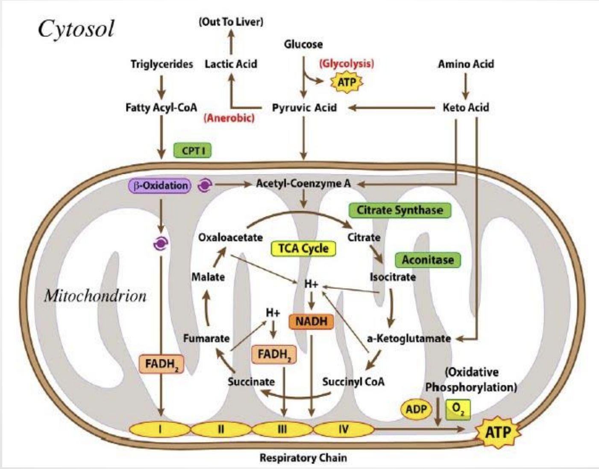
  <figcaption style="text-align: center; font-size: 0.95em;">
    Overview of catabolic pathways showing the relationship between carbohydrates, triglycerides and amino acids in ATP production. Credit: <a href="https://www.medicineofcycling.com/wp-content/uploads/2016/08/SanMilan-Inigo-Cycling-Physiology-and-Physiological-Testing.pdf">Iñigo San Millán</a>
  </figcaption>
</figure>

To prevent bonking, it's crucial to consume carbohydrates during exercise to maintain the glucose catabolic pathway active, which would otherwise be depleted in about 90-120 minutes of intense exercise.

> **Note:** For an in-depth understanding of sport physiology, I highly recommend [Physiology of Sport and Exercise](https://books.google.com/books?id=tsy4BwAAQBAJ&printsec=frontcover#v=onepage&q&f=false). I first explored this book as a teenager, eager to understand my track and field performance. Now in its 9th edition, it remains a leading resource. Chapter 2 covers bioenergetics and muscle metabolism, topics directly relevant to this discussion.

> **Note:** By measuring the Respiratory Exchange Ratio (RER), athletes and coaches can assess the balance between carbohydrate and fat metabolism during exercise. The RER is a useful metric for understanding fuel utilization during exercise. RER is calculated as the ratio of carbon dioxide produced (VCO₂) to oxygen consumed (VO₂). An RER of 1.0 indicates complete oxidation of glucose (C₆H₁₂O₆ + 6O₂ → 6CO₂ + 6H₂O), while an RER of ~0.7 reflects oxidation of fats, such as palmitic acid (C₁₆H₃₂O₂ + 23O₂ → 16CO₂ + 16H₂O).

## What Type of Carbohydrates Are Best?
The key factor in choosing carbohydrates to consume during exercise is how efficiently your body can absorb and utilize them. Rapid absorption depends first on gastric emptying, which is slowed by high osmolality (solute concentration). Sports drinks and gels are often formulated to be isotonic, about 6% carbohydrate (6g per 100ml), to optimize this process.  
Once in the small intestine, carbohydrates are absorbed via two main transporters: SGLT1 (sodium-dependent for glucose and galactose) and GLUT5 (for fructose). SGLT1 typically absorbs glucose at a limited rate of [about 1 g/minute](https://pmc.ncbi.nlm.nih.gov/articles/PMC5371619/), while GLUT5 absorbs fructose at around 0.5 g/minute. These two pathways are functionally independent. By combining glucose and fructose, you can increase total absorption to approximately 1.5 g/minute (90 g/hour). Individual absorption rates vary, and can improve with "gut training", but the principle is clear: **using both glucose and fructose together maximizes carbohydrate uptake and performance during endurance exercise**.  
Another important factor to consider is that when high doses of a single carbohydrate source are ingested, the unabsorbed sugar remains in the gut, increasing the osmotic pressure and drawing water into the intestine, which is a primary cause of bloating, cramping, and diarrhea.

The optimal glucose source for endurance nutrition is [maltodextrin](https://en.wikipedia.org/wiki/Maltodextrin), a glucose polymer (polysaccharide) with significantly lower osmolality compared to monosaccharides like glucose and galactose. This property allows you to dissolve a higher quantity of carbohydrate in a solution while keeping it isotonic, which promotes faster gastric emptying. Glucose has a very high glycemic index (GI), meaning it raises blood sugar levels quickly and provides a readily available catabolic substrate.  
Fructose, on the other hand, is not easily catabolized by skeletal muscle cells. After absorption, it is transported to the liver, where it is converted to glucose, lactate, or triglycerides ([reference](https://www.researchgate.net/publication/315541127_Fructose_Metabolism_from_a_Functional_Perspective_Implications_for_Athletes)). These newly formed glucose and lactate molecules are then released into the bloodstream, where they travel to the working muscles and are oxidized for energy. This means that fructose has a lower glycemic index (GI) than glucose and provides a secondary, indirect, and parallel stream of energy that complements the direct and rapid fueling provided by glucose ([reference](https://pmc.ncbi.nlm.nih.gov/articles/PMC6852172/)).

## What Is the Optimal Glucose-to-Fructose Ratio?

The best glucose-to-fructose ratio depends on your carbohydrate intake rate during exercise. For intakes below 60 g/hour, glucose alone (typically as maltodextrin) is generally sufficient. When intake exceeds 60 g/hour, research supports a 2:1 glucose-to-fructose ratio as optimal, allowing absorption rates up to 90 g/hour ([source](https://journals.lww.com/acsm-msse/fulltext/2008/02000/superior_endurance_performance_with_ingestion_of.12.aspx)). For athletes who have trained their gut and are exercising intensely for longer than three hours, increasing the fructose proportion, such as a 1:0.8 glucose-to-fructose ratio, can help surpass the SGLT1 absorption limit for glucose ([reference](https://www.mysportscience.com/post/the-optimal-ratio-of-carbohydrates)).

<figure style="width: 66%; margin: 0 auto;">
  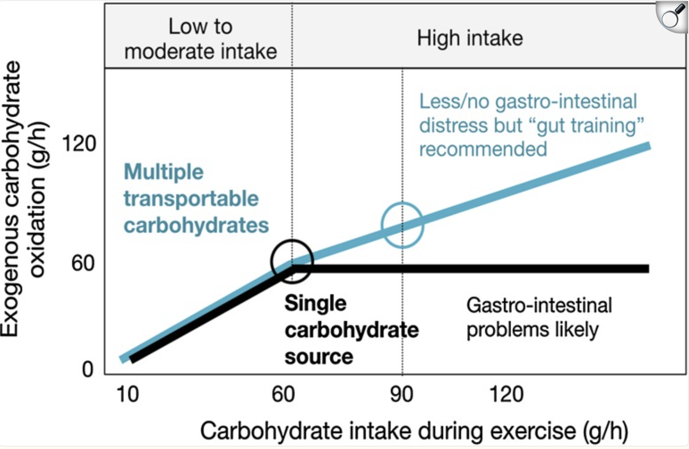
  <figcaption style="text-align: center; font-size: 0.95em;">
    Optimal carbohydrate intake rates and glucose-to-fructose ratios for endurance exercise, showing how dual-transporter utilization enables higher absorption rates. Reference: <a href="https://pmc.ncbi.nlm.nih.gov/articles/PMC5371619/">Jeukendrup, 2017</a>
  </figcaption>
</figure>

Personally, I rarely train or race for more than three hours at high intensity, so I don’t need to exceed the 60 g/hour or even 90 g/hour carbohydrate intake threshold. For my needs, a glucose-to-fructose ratio between 3:1 and 2:1 is ideal, as it supports efficient absorption while minimizing gastrointestinal discomfort. Regardless of the ratio, it’s essential to add enough water to achieve an isotonic solution (about 6% carbohydrate concentration), which optimizes gastric emptying. If you’re using commercial gels or drinks, or consuming additional water alongside concentrated gels or chews, you’re effectively maintaining this isotonic balance.

For example, during a Sprint distance triathlon, which lasts just over an hour, I typically use a 3:1 ratio of isotonic solution of 45 g maltodextrin plus 15 g fructose dissolved in a single water bottle I keep on my bike (which I rarely finish). I also take a couple of gels (each containing 25 g of a 3:1 solution): one before the swim and one during the run. For an Olympic distance triathlon, which takes me about 2 hours and 15 minutes, I maintain similar proportions but always finish the bottle and consume two gels during the run. In longer cycling races or endurance training sessions (>3h), I sometimes increase my intake to 80 g/hour with a 3:1 ratio. I have little interest in training my gut to tolerate higher fructose concentrations, so this is my upper limit. I am also mindful of the potential side effects of regularly consuming large amounts of carbohydrates during exercise, especially fructose, which places extra demand on the liver and kidneys. During long training sessions that aren’t races, I also eat bars, bananas, and anything appetizing and easy to digest. Enjoying this part of the sport is important too!

## Recipe for Concentrated Carbohydrate Gel
In the event you need to carry with you a large amount of carbohydrates for a very long endurance effort, a highly concentrated gel is a great option. A concentrated gel allows you to decouple your water supply from your feeding supply. Water can be easily refilled, used for cooling, while isotonic solutions are more difficult to carry in large quantities, due to their volume and weight.

For example, imagine you are planning a 5-hour ride with that group of friends who always say they'll take it easy, but act very differently when the road starts going uphill (I miss you, guys! 😜). In such a scenario, you probably want to bring at least 60 g × 5 = 300 g of carbohydrates. If this quantity were all in the form of isotonic solution, you would need 300 g × 100 / 6 = 5 liters of solution at 6% concentration. That's more than six 750 mL bottles, which is clearly impossible to carry. So, normally you would bring lots of solid food, like energy bars, if you don't want to under fuel and risk bonking. Solid food is more difficult to digest and absorb. This is when a highly concentrated gel would serve you well. Just don't forget to drink plenty of water with it!

The goal is to prepare a carbohydrate gel that fits into a 250 mL silicone flask and contains 250 g of carbohydrates. While this may seem impossible at first, keep in mind that the gel’s density is much higher than water. Even after adding water to dissolve 250 g of powder, the mixture will still fit within the 250 mL volume. Heat helps the powders dissolve in a minimal amount of water.  
Below is the recipe I have tested, which works well. I chose a ratio of maltodextrin-to-fructose 3:1, but you can adjust it to your preference.

### Ingredients

<figure style="width: 66%; margin: 0 auto;">
  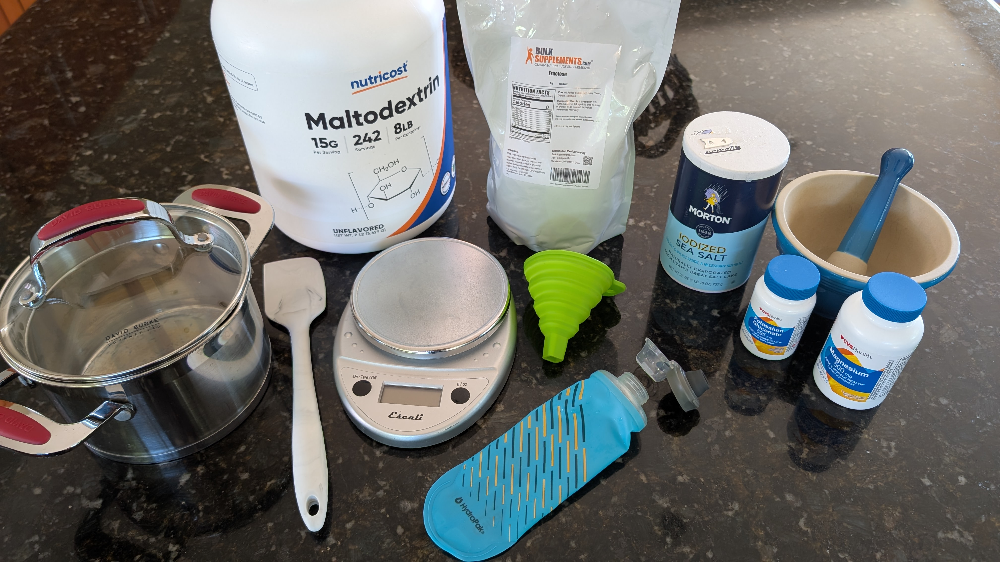
  <figcaption style="text-align: center; font-size: 0.95em;">
    Ingredients and tools needed for creating the concentrated carbohydrate gel.
  </figcaption>
</figure>

- **188 g** [maltodextrin powder](https://nutricost.com/products/nutricost-maltodextrin-powder?variant=28696088739914)
- **62 g** [fructose powder](https://www.bulksupplements.com/products/fructose-powder?variant=32133401935983)
- **2 g salt**
- **Potassium tablet**
- **Magnesium tablet**
- **Water** (about 70 mL, just enough to dissolve the powders)
- **Pestle and mortar** (for grinding tablets)
- **250 mL silicone flask** ([example](https://www.hydrapak.com/products/softflask-250ml?variant=44433769890025))
- **Pot** (for mixing and heating)
- **Silicone spatula**
- **Scale** (for accurate measurement)
- **Funnel** (for transferring gel to flask)
### Step 1: Grind the Electrolyte Tablets

Purchasing potassium gluconate and magnesium tablets from the pharmacy is often more cost-effective than buying pre-made electrolyte powders. However, you'll need to grind the tablets into a fine powder to ensure they dissolve evenly in your gel mixture.

<figure style="display: flex; justify-content: space-between; align-items: flex-start; width: 100%; margin: 0 auto;">
  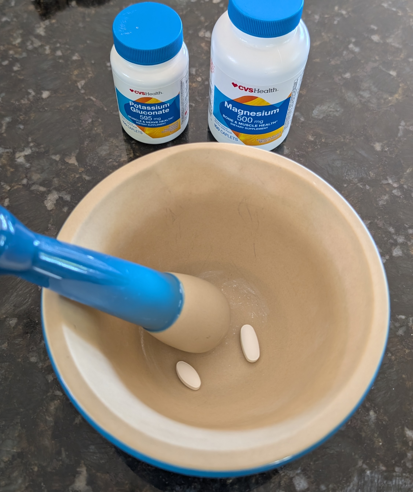
  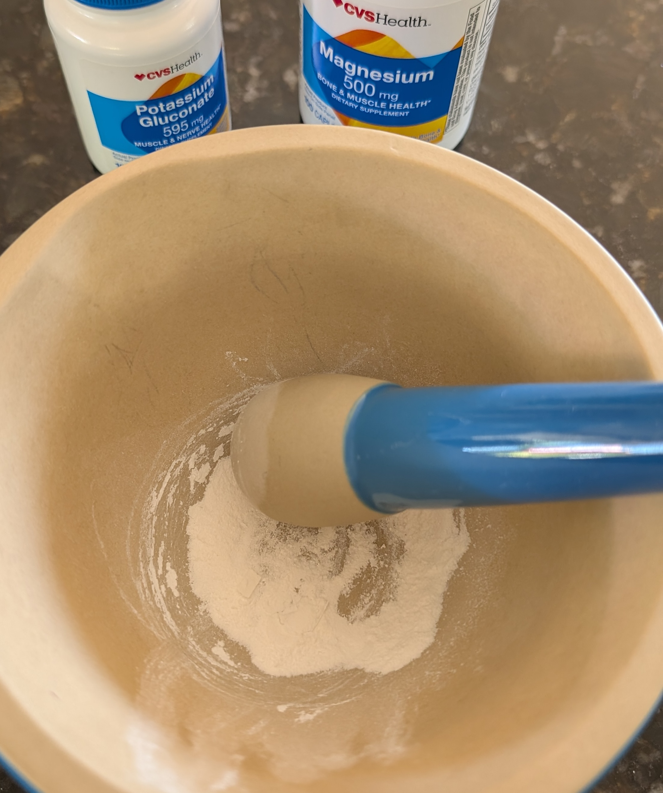
</figure>
<figcaption style="text-align: center; font-size: 0.95em; width: 100%; margin: 0 auto;">
  Use a pestle and mortar to grind the potassium and magnesium tablets into a fine powder.
</figcaption>

### Step 2: Combine All Powders in a Pot

Weigh out the maltodextrin and fructose, then add 2 g of salt along with the ground potassium and magnesium tablets. Mix all dry ingredients thoroughly in a pot. Adjust the quantity of salt based on your expected sweat loss and personal taste. The salt helps with electrolyte balance, especially during long rides or runs.

<figure style="width: 66%; margin: 0 auto;">
  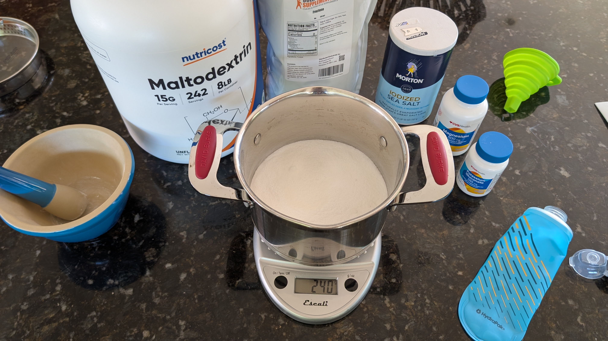
  <figcaption style="text-align: center; font-size: 0.95em;">
    Mixing the dry ingredients together before adding water.
  </figcaption>
</figure>

Next, add about 70 mL of water to the pot. Although the mixture may appear too dry to dissolve all the powders, heating will help achieve a smooth consistency. (In the image below, more water was used, but later trials confirmed that 70 mL is sufficient.)

<figure style="width: 66%; margin: 0 auto;">
  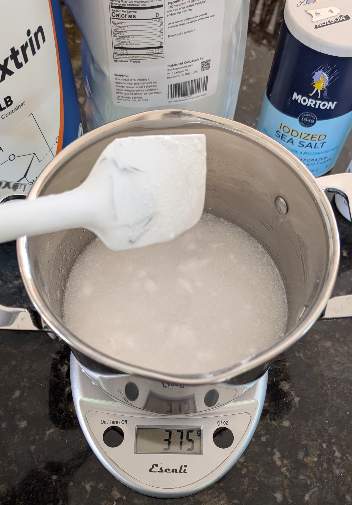
</figure>

### Step 3: Heat and Dissolve

Set the pot over medium-low heat and stir the mixture continuously. Gentle heating helps the powders dissolve, transforming the mixture into a smooth, homogeneous gel within 5–10 minutes. Take care not to let the mixture boil or overheat, as this can lead to caramelization (which I experienced in my first attempt; see the yellowish tint of the gel).

<figure style="display: flex; justify-content: space-between; align-items: flex-start; width: 100%; margin: 0 auto;">
  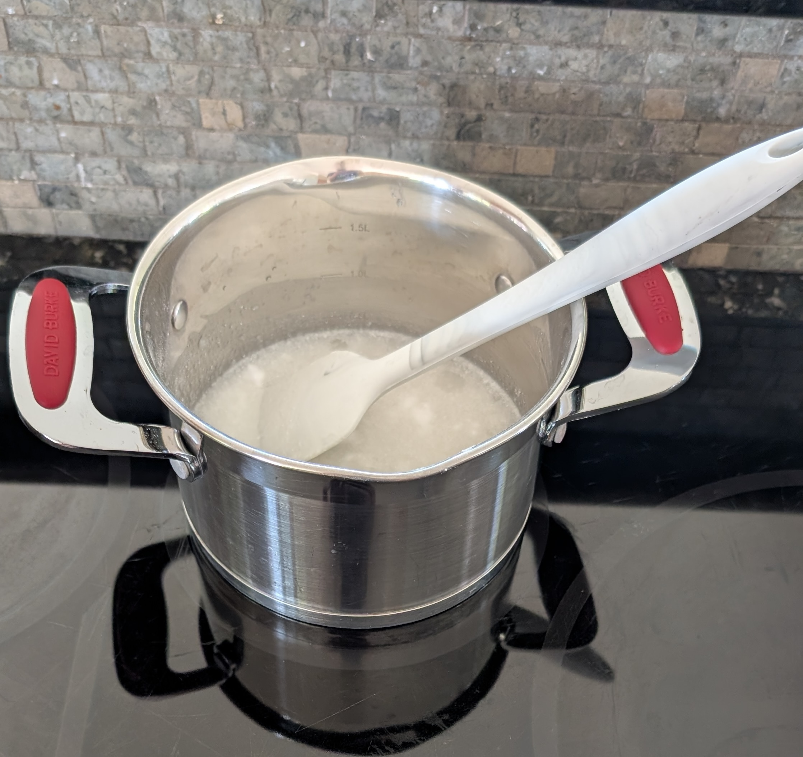
  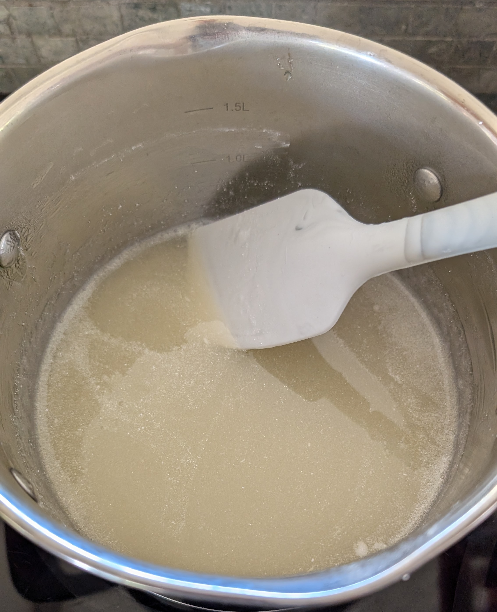
</figure>
<figcaption style="text-align: center; font-size: 0.95em; width: 100%; margin: 0 auto;">
  Gently heat the mixture while stirring to dissolve all powders. The gel becomes smooth and uniform as the powders fully dissolve.
</figcaption>

### Step 4: Transfer the Gel into the Flask

<figure style="display: flex; justify-content: space-between; align-items: flex-start; width: 100%; margin: 0 auto;">
  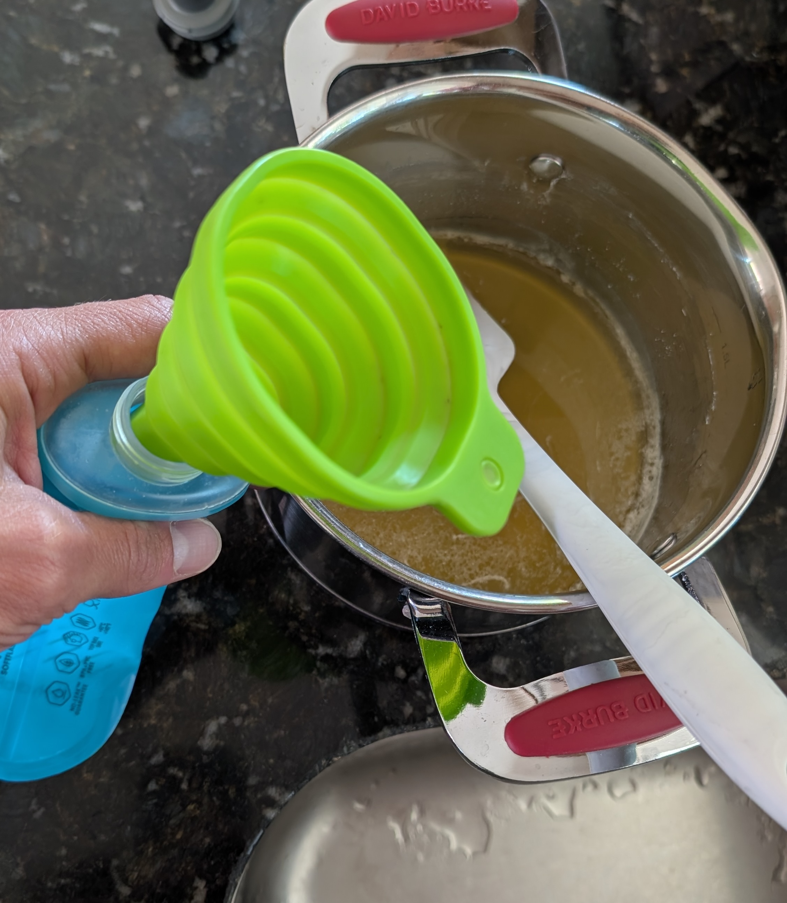
  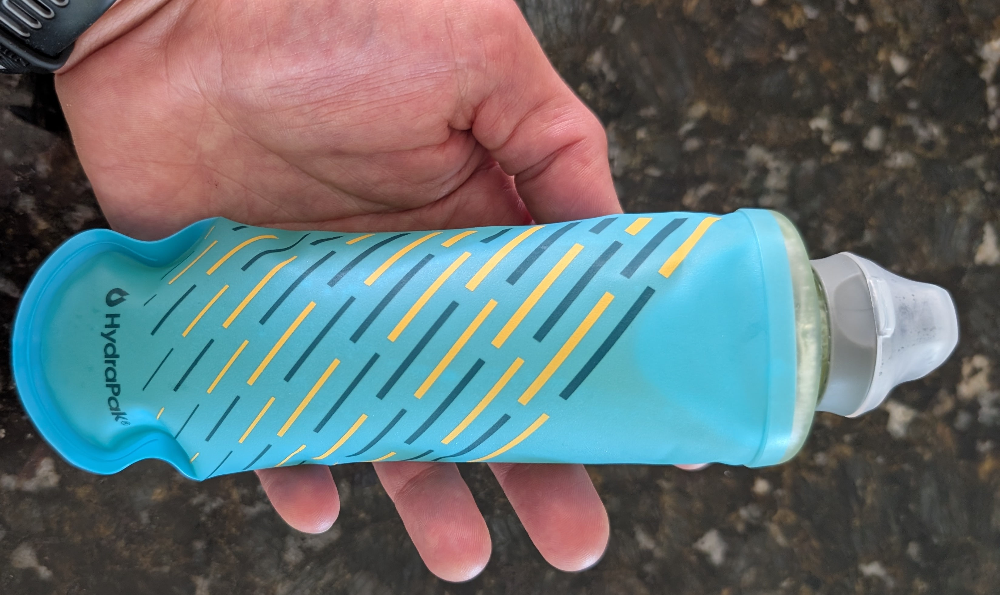
</figure>
<figcaption style="text-align: center; font-size: 0.95em; width: 100%; margin: 0 auto;">
Transferring the finished concentrated gel into a portable silicone flask. Final product: 250 g of carbohydrates concentrated in a 250 mL flask, ready for endurance activities.
</figcaption>

Store the flask in the refrigerator until your next endurance session. The gel will keep for several days and provides a convenient, concentrated energy source that travels well.