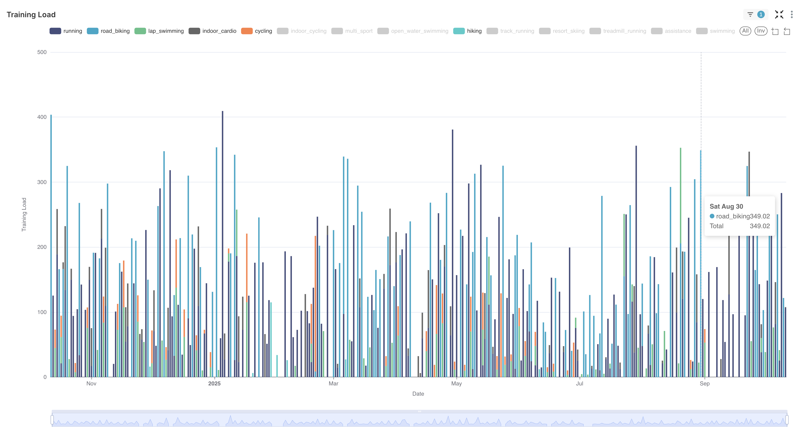
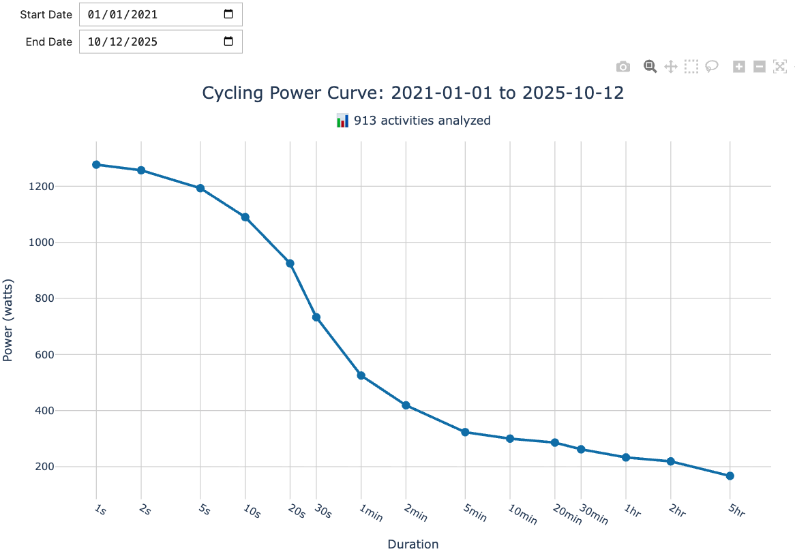

<!--more-->

## Break Free


Across years of scientific research and computer engineering, I've seen how data and information is routinely under-captured, and even when collected, it's often under-utilized. Sometimes this is the result of a shortsighted and self-serving culture, one that prioritizes reinforcing predetermined narratives over the pursuit of genuine knowledge, understanding, or solutions that advance our collective intelligence and well-being. In other cases, data is intentionally obscured, made inaccessible, or even manipulated to serve specific agendas. Consider the unpublished dataset to make a scientific claim appear more robust than it truly is, so the PI secures the next grant. Or the engineering simulations that remain elusive, accessible only to "John Brown," whose gatekeeping cements their indispensability while impeding critical scrutiny and growth of intelligence infrastructure. Or the manufacturing operations data trapped in spreadsheets that satisfy immediate reporting needs (units per week to the CEO) but prevent engineering teams from analyzing patterns, diagnosing failures, and improving processes. 
 
I'll stop there ... 

An important part of my work over the past years has been countering such tendencies. I've architected and implemented systems to collect engineering data and democratize access to its analysis, empowering individuals and teams to understand their own work and others' in pursuit of collective intelligence. Among the lessons learned, one stands out: 

> **The fundamentals of data engineering matter far more than the latest trends or tools.**

By building automations that feed thoughtfully designed structured datasets, first and foremost relational schemas, one achieves a critical advantage over higher-entropy approaches. The key is building flexibility where requirements are unknown or likely to change, while applying constraints where they're stable.

This structure delivers multiple benefits:
- Efficient, performant querying and analysis.
- Elevated accessibility and understanding of the data.
- Increased accuracy of LLM-powered analytics.

When data is well-structured, documented, and accessible, intelligence compounds. When it's trapped in silos or poorly organized, intelligence stagnates, regardless of whether you're using dbt, Databricks, or Snowflake.

We live in an age of unprecedented data generation. Yet much of this data remains trapped in SaaS platforms that offer only limited access and constrained analytics. Actionable intelligence requires far more: 
- control over your data's structure.
- ability to combine it with other sources.
- flexibility to apply whatever analytical tools serve your questions.
- capacity to share your work so others can reproduce and extend your analysis.

> **When your data lives in someone else's silo, you're renting insights, not owning them.**

This reality becomes even sharper as LLM agents enter the picture. People are beginning to realize that for a growing number of use cases, the UI or analytics tools a SaaS platform provides matter far less than the data itself. With [MCP servers](https://modelcontextprotocol.io/docs/getting-started/intro) proliferating weekly, LLM-powered analytics can provide conversational access to information and its analysis, often delivering a more natural and intuitive interface than traditional menu-driven UIs. Yet their accuracy remains fundamentally constrained by the quality and accessibility of the underlying data.

When you control properly structured data, you can query it conversationally, analyze it programmatically, and extract insights that evolve with your questions. While MCP servers do enable LLM agents to retrieve data from SaaS platforms, they don't solve the core problem: the data and its structure remain behind someone else's wall, not in your hands.

From this desire to own both the data and the insights it yields came [OpenETL](https://github.com/diegoscarabelli/openetl).

## OpenETL: The Data Engineering Bicycle


[OpenETL](https://github.com/diegoscarabelli/openetl) is an open-source repository that provides a simple yet robust and empowering framework for building ETL (Extract, Transform, Load) data pipelines and structured datasets. No cloud services required. In its current form, it is built entirely on leading open-source tools:

- **[Apache Airflow](https://airflow.apache.org/)**: The industry-standard workflow orchestration platform. Airflow gives you programmatic control over your data pipelines (your workflows are Python code, version-controlled, testable, and extensible). It handles scheduling, retry logic, monitoring, and complex task dependencies with a powerful web UI for oversight.

- **[PostgreSQL](https://www.postgresql.org/)**: The most advanced open-source relational database. PostgreSQL provides ACID compliance, powerful query optimization, rich data types, full-text search, and a mature ecosystem of extensions. It's the foundation for analytical queries and data warehousing.

- **[TimescaleDB](https://www.timescale.com/)**: A PostgreSQL extension optimized for time-series data. TimescaleDB adds hypertables (automatically partitioned tables for time-series), continuous aggregates, data retention policies, and specialized time-series functions, while maintaining full SQL compatibility and PostgreSQL's reliability.

They have been the foundations of the data analytics platforms I architected for [Cerebras](https://www.cerebras.ai/) and [Tenstorrent](https://tenstorrent.com/en), although deployed in a hybrid cloud-computing context alongside additional services for scaling processing and storage, integration, governance and monitoring. You can run the entire stack on your laptop or your homelab server. You're in control.

### Getting Started Is Remarkably Simple

In an attempt to make OpenETL approachable to a larger audience, the [Getting Started guide](https://github.com/diegoscarabelli/openetl#getting-started) provides guidance and templates for common deployment scenarios, clarifying requirements and dependencies while leaving the actual implementation choices to you:

1. **Database initialization**: PostgreSQL/TimescaleDB setup guidance.
2. **Airflow deployment**: Templates and instructions for two recommended approaches:
   - **Astro CLI** for local development (MacOS/Linux/Windows).
   - **Docker Compose** for Linux servers.
3. **Development environment**: For those who want to contribute or extend the framework.

The [Infrastructure as Code (IaC)](https://github.com/diegoscarabelli/openetl/tree/main/iac) directory contains installation scripts, configuration templates, and deployment guides. These resources give you a solid starting point while preserving flexibility to adapt to your specific environment. You can go from zero to running pipelines in an afternoon.

## The Garmin Connect Pipeline

The first data pipeline I built in OpenETL emerged from a bit of an obsession: owning my sports and health data insights. For years, my Garmin watches recorded most of my road runs and night's sleep, but the complexity increased when I transitioned from track and field to triathlon. Three disciplines, running, cycling, swimming, each with distinct metrics, physiological demands, and training zones. As my training grew more sophisticated, so did my analytical needs. 

Yet the prospect of mastering TrainingPeaks' UI or accepting Garmin Connect's limited pre-made analytics dashboards felt wrong. I wanted the data structured and queryable on my terms. This was a perfect use case for showcasing the OpenETL framework: extracting data from proprietary platforms and structuring it for unrestricted analysis. 

So I built the [Garmin Connect data pipeline](https://github.com/diegoscarabelli/openetl/tree/main/dags/pipelines/garmin).

### What the Pipeline Does

The Garmin pipeline extracts comprehensive data from Garmin Connect using the [python-garminconnect](https://github.com/cyberjunky/python-garminconnect) library, which depends on [garth](https://github.com/matin/garth) for Garmin Connect authentication and session management. Before building this, I searched extensively for existing tools or projects that could do what I had in mind, but I did not find anything satisfactory. The challenge is compounded by the fact that Garmin's Health API isn't public. Access requires a business partnership, which I couldn't secure as an individual user. 

The pipeline extracts two main types of data:

**Wellness Data** (JSON format):
- Sleep analysis: stages, HRV, breathing disruptions, restlessness.
- Training metrics: readiness scores, training status, VO2 max, race predictions.
- Physiological data: heart rate, stress levels, body battery, respiration.
- Activity tracking: steps, floors, intensity minutes.
- Personal records and user profile.

**Activity Data** (FIT files):
- Detailed time-series: lap metrics, split data, sensor readings.
- Device information and activity metadata.

All of this gets processed through a four-task [DAG](https://airflow.apache.org/docs/apache-airflow/2.5.2/core-concepts/dags.html):

```
extract >> ingest >> batch >> process >> store
```

The pipeline runs daily, automatically pulling the previous day's data. But you can also trigger manual runs to backfill years of historical data in a single execution. I pulled over 8 years of my training and wellness history.

### The Database Schema: Where Intelligence Starts

The Garmin pipeline populates nearly thirty tables organized in the `garmin` relational schema of the `lens` TimescaleDB database. Unlike JSON or NoSQL databases, relational databases offer several advantages for analytical use cases:

1. **Self-documenting**: Table definitions, column names, SQL comments, foreign key relationships, all provide readily accessible semantic context.

2. **SQL language**: SQL is a stable, well-known analytical language, which SQL databases plan and optimize before executing.

3. **Relational integrity guarantees**: Fixed columns, data types, constraints and relationships provide a solid and trustworthy backbone that one can rely on for analysis.

This isn't just data storage, it's a curated analytical dataset designed for insight generation and query performance. 

### LLM-Powered Analytics

One of the most compelling advantages of a well-structured relational database is how effectively it enables LLM-powered analytics. I was eager to test whether an LLM agent could accurately and quickly answer analytical questions using this data.

I had already gained valuable insights into LLMs' ability to convert natural language to SQL through my work on the [Apache Superset AI Assistant](https://github.com/tenstorrent/apache-superset-tt/blob/awilliamsTT/ai-assistant/docs/docs/configuration/ai_assistant.mdx), which massively democratized and accelerated analysis of hardware and software test and performance data at Tenstorrent. The natural next step was to leverage [GitHub Copilot Chat](https://docs.github.com/en/copilot/how-tos/chat-with-copilot) equipped with the [PostgreSQL extension](https://learn.microsoft.com/en-us/azure/postgresql/extensions/vs-code-extension/quickstart-github-copilot) in [VSCode](https://code.visualstudio.com/) to answer analytical questions about my Garmin data.

> **Relational databases with well-documented schemas are uniquely positioned to enable accurate LLM-powered analytics automation.**

Imagine very open questions like:

- *"Why am I feeling more sleepy in the morning and tired in training during these past few days?"*
- *"What's the correlation between my sleep quality and next-day training readiness over the past 6 months?"*
- *"Show me weeks where my acute-to-chronic workload ratio was in the optimal range and how that related to race performance."*
- *"How does my cycling power curve relate to my running lactate threshold pace?"*
- *"Compare my resting heart rate in summer vs. winter, accounting for temperature acclimatization."*

Displaying what Copilot does to answer the first question illustrates the power of feeding an LLM agent with data from a well-structured relational database:

1. **Schema comprehension**: It reads the schema, understanding table relationships and the semantic meaning of each attribute.
2. **SQL generation**: It generates sequential queries to extract data it believes to be relevant: sleep quality, training load, readiness scores, body battery, and stress levels over the past two weeks. The schema context ensures syntactically correct and analytically accurate queries, only rarely requiring self-correction.
3. **Pattern recognition**: It interprets query results, identifying patterns such as consecutive high training loads, declining sleep quality, and reduced body battery recovery. Then synthesizes these findings into a coherent answer with supporting data tables.

As an example of the SQL it generated to analyze recent training load and recovery metrics:

```sql
-- Training Load Analysis - Past 14 Days
-- Description: Analyze recent training load and intensity to identify overtraining
--              patterns.
-- Written by @pgsql [Claude Sonnet 4.5 (Preview)]
-- Analyze recent training load and recovery metrics
WITH recent_training AS (
    SELECT 
        DATE(start_ts AT TIME ZONE 'UTC' + INTERVAL '1 hour' * timezone_offset_hours) AS activity_date,
        activity_type_key,
        activity_name,
        ROUND((duration / 3600.0)::numeric, 2) AS duration_hours,
        activity_training_load,
        aerobic_training_effect,
        anaerobic_training_effect,
        difference_body_battery,
        average_hr,
        moderate_intensity_minutes,
        vigorous_intensity_minutes
    FROM garmin.activity 
    WHERE start_ts >= CURRENT_DATE - INTERVAL '14 days'
    ORDER BY start_ts DESC
),
daily_training_summary AS (
    SELECT 
        activity_date,
        COUNT(*) as num_activities,
        ROUND(SUM(duration_hours)::numeric, 2) as total_hours,
        ROUND(SUM(activity_training_load)::numeric, 1) as daily_training_load,
        SUM(difference_body_battery) as body_battery_drain,
        SUM(moderate_intensity_minutes + vigorous_intensity_minutes) as total_intensity_minutes
    FROM recent_training
    GROUP BY activity_date
)
SELECT 
    activity_date,
    num_activities,
    total_hours,
    daily_training_load,
    body_battery_drain,
    total_intensity_minutes,
    CASE 
        WHEN daily_training_load > 200 THEN 'Very High Load'
        WHEN daily_training_load > 150 THEN 'High Load'
        WHEN daily_training_load > 100 THEN 'Moderate Load'
        WHEN daily_training_load > 50 THEN 'Light Load'
        ELSE 'Recovery Day'
    END as load_assessment
FROM daily_training_summary
ORDER BY activity_date DESC;
   ```

How quickly it delivers the completed analysis is remarkable. 

Soon, if not already by the time you read this, you'll be able to:

- **Ask the agent to build dashboards** in your visualization tool of choice (Apache Superset, Grafana, etc.) using their MCP servers.
- **Request deeper analysis** through generated Python code or Jupyter notebooks that perform statistical analysis or machine learning on your data.
- **Send automatic reports** summarizing trends, anomalies, and insights on a regular basis.

Conversational access to your curated datasets transforms how you interact with data, enabling you to pursue dynamic, evolving questions in real-time.

### Dashboards

Beyond LLM-powered analytics, traditional dashboards remain invaluable for monitoring the questions you consistently want answered as new data arrives. With open-source tools like [Apache Superset](https://superset.apache.org/), [Grafana](https://grafana.com/oss/grafana/), and [Plotly](https://plotly.com/python/), you can build custom, rich analytical workflows tailored to your specific needs. And because you control both the schema and the data, you can leverage LLM text-to-SQL capabilities to accelerate your query development, particularly with in-app AI assistants like the one we built at Tenstorrent for [Superset](https://github.com/tenstorrent/apache-superset-tt/blob/awilliamsTT/ai-assistant/docs/docs/configuration/ai_assistant.mdx).

For instance, you can visualize your training load over time in a Superset chart, broken down by activity type:

<div style="text-align: center; margin: 30px 0;">
    
</div>

Or build an interactive Plotly chart in a Jupyter Notebook with a time range selector to explore how your cycling power curve evolves over time, showing the maximum power sustained across increasing time intervals, aggregated from every ride within a specified period:

<div style="text-align: center; margin: 30px 0;">
    
</div>
I'm still building out dashboards in Superset and Grafana for the Garmin dataset, and I'm genuinely enjoying how straightforward the process is with the structured schema provided by the OpenETL pipeline. 

For those unfamiliar with these popular open-source analytics tools, they complement each other beautifully and cover virtually every visualization and alerting need. I've relied on them for years in professional contexts and have never felt compelled to replace them with commercial alternatives. Both offer enterprise managed services, but that's unnecessary for individual or small team use cases. With proper deployment, we've run their OSS at scale supporting hundreds of daily active users.

Superset excels at relational data analytics, offering a thoughtful feature set that welcomes both experienced SQL writers and those less comfortable with queries. Grafana shines for time-series analytics, with purpose-built components for managing time ranges and temporal analysis patterns.

### Future Directions
The Garmin pipeline currently relies on the Garmin Connect API, which means data still flows through Garmin's servers. Yet if you own a Garmin device and have a computer, there's no fundamental reason you shouldn't be able to extract data directly from the hardware itself, or better yet, have the device automatically upload it to your computer's filesystem. 

The FIT (Flexible and Interoperable Data Transfer) files stored on Garmin devices are accessible when mounted as USB mass storage devices. However, that's only part of the solution: we need access to all the data the device collects (not just activities) and the derived metrics it computes, sleep analysis, heart rate variability, stress levels, and more. While I haven't investigated this thoroughly yet, direct device extraction appears feasible, though likely complex.

By reading data directly from devices, we could bypass cloud dependencies altogether, achieving complete data sovereignty from the moment of collection.

## Let's Build Together

OpenETL is an invitation to collaborate. The framework is designed to be extended. The [Standard DAG pattern](https://github.com/diegoscarabelli/openetl#standard-dag) provides a template that can be easily customized. OpenETL represents one way to foster a community-driven movement toward data intelligence ownership and personal investigation. 

See the [Contributing guide](https://github.com/diegoscarabelli/openetl/blob/main/CONTRIBUTING.md) for details on the contribution workflow. 

The future of personal intelligence is open source. Let's make it happen.

---

*Have questions or ideas? Open a [discussion on GitHub](https://github.com/diegoscarabelli/openetl/discussions) or reach out in the comments below.*


