<!--more-->

Recent exchanges with my parents highlighted how one's immediate social circle can serve as a powerful catalyst in breaking through the formidable barriers that prevent us from confronting truth and taking meaningful action. This is likely due to a superior level of empathy and trust that is generally attributed to family members and close friends. Some of these barriers are:

- The Matrix: the systemic deception aimed at manufacturing your consent for your disempowerment and exploitation.
- Analytical laziness: the middle ground fallacy (*"The truth lies in the middle"*), is among the worst forms of dogmatism, the antithesis of intellectual inquiry. One needs to put in substantial time and effort to uncover and consider the evidence, distinguishing facts from deception.
- Conformity: the tendency to avoid social friction and fit in the average of your social network, your tribe.
- Denial: an understandable defense mechanism against the immorality, cruelty and horror of much of reality.

A topic that is plagued by all of these barriers in their full force is that of Palestine. Decades of investigative reporting, historical analysis, human rights work and activism, by countless brave individuals and organizations that have spoken the truth about what has been happening since the creation of the State of Israel in 1948 (and leading to it), have not yet managed to defeat widespread disinformation. The result is that public opinion has been fractured and mobilization for practical action remains limited to this day. It's such a heartbreaking tragedy.

This essay aggregates factual context and analysis which I hope can be that catalyst, if you need one, which dissolves the consent for the Pain Machine. Let's go down the rabbit hole.

## Hamas Attacks of October 2023

The Independent International Commission of Inquiry (the Commission) of the UN Human Rights Council ([OHCHR](https://www.ohchr.org/en/ohchr_homepage)) reported in June 2024 on the findings of their investigation of the events of October 7, 2023 in [A/HRC/56/CRP.3](https://www.ohchr.org/sites/default/files/documents/hrbodies/hrcouncil/sessions-regular/session56/a-hrc-56-crp-3.pdf). They collected evidence such as photos, videos, social media content, official data, submitted documents, remote witness testimony. They noted that Israel barred the Commission access to the relevant sites in Israel and the occupied Palestinian territory (oPt), instructed medical personnel not to speak with the Commission, and obstructed investigations into acts of sexual violence by denying meetings with alleged victims. They also noted a systematic lack of forensic evidence collection by Israeli authorities. In examining the evidence they obtained, they applied cross-referencing and forensic evaluation. This report is the most comprehensive and reliable account of what happened that day I could find.

In addition, Al Jazeera Investigative Unit also conducted an in-depth investigation into these events by examining hours of footage from CCTV, dashcams, personal phones and headcams of dead Hamas fighters, and published their findings in the documentary [October 7](https://www.ajiunit.com/investigation/october-7/).

### What Happened 

On October 7, 2023, at approximately 6:30 AM, Hamas's military wing, called the Izz ad-Din alQassam Brigades, and other Palestinian armed groups and civilians launched a coordinated multi-pronged attack on Israel. The assault began with a heavy barrage of over 2000 rockets and mortars, providing cover for militants who breached the border wall at about thirty locations using explosives and bulldozers. An estimated 1,000 or more attackers entered Israel by land, sea, and motorized hang-gliders, targeting 24 localities, eight military bases, public spaces, and roads across southern Israel. The [kibbutz](https://en.wikipedia.org/wiki/Kibbutz) surrounding the Gaza Strip territory (particularly Be'eri and Nir Oz) were the most heavily targeted areas, alongside a music festival happening in the area that day. 

The number of Israeli and foreign nationals casualties on that day, according to Israeli authorities are as follows:

| Category | Value | Notes |
|----------|--------|-------|
| Killed | ~1,150 | Includes ~ 300 Israel security forces personnel and ~ 800 civilians of which 36 children (13 under the age of 12, 2 of which babies). |
| Injured | ~14,900 | Transferred to hospitals for treatment. |
| Hostages | 252 | Taken to Gaza. Includes 90 women and 36 children. |

An undetermined number of Palestinians also died that day. Israel initially reported approximately 1,400 total casualties, later revising this figure downward after acknowledging that around 200 bodies were Palestinian combatants, misidentified due to severe burns or mutilation. Since no independent assessment of these figures was permitted, the actual number of Palestinian casualties remains uncertain and is likely underestimated.

Hamas militants committed war crimes that day in intentionally harming civilians. Beyond the widespread willful killing of civilians, the Commission documented credible instances of torture, mutilation, burning of bodies, and sexual violence, although signaling remarkable uncertainties due to inability to visit the sites and the mishandling of the crime scenes by Israeli responders. Civilians and military personnel were abducted and taken to Gaza with the stated intent of exchanging them for Palestinian prisoners/hostages held by Israel. Hamas also fired rockets indiscriminately at civilian areas, though these resulted in a relatively small portion of overall casualties. Unfortunately, there appears to have been little to no thorough forensic examination of bodies undertaken by Israeli authorities, hence the lack of detail on the dynamics and extent of such crimes.

Israel's military and paramilitary forces (commonly referred to as Israeli Security Forces, ISF, or Israeli Defense Forces, IDF) also committed war crimes that day by harming civilians. The Commission documented credible evidence that the ISF applied the [Hannibal Directive](https://en.wikipedia.org/wiki/Hannibal_Directive), a controversial procedure designed to prevent soldier capture at any cost, including the prevention of civilian capture. Israeli newspaper [Haaretz](https://www.haaretz.com/israel-news/2024-07-07/ty-article-magazine/.premium/idf-ordered-hannibal-directive-on-october-7-to-prevent-hamas-taking-soldiers-captive/00000190-89a2-d776-a3b1-fdbe45520000) also reported its use on October 7. This directive resulted in an unknown number of Israeli civilian deaths, casualties for which the Israeli military bears direct responsibility. Evidence includes structural damage from tank artillery, video footage from ISF helicopters armed with heavy weaponry destroying vehicles and houses, survivor testimony, and admissions by Israeli commanders themselves. In Be'eri, for example, tank shells fired at a house containing civilian hostages killed both Hamas militants and thirteen civilians, leaving only two survivors. The Commission's detailed report on this incident provides further documentation of the methods employed by the Israeli military to secure the area.

A particularly puzzling fact is that the Israeli military response was significantly delayed and inadequate. For many hours, small local rapid response teams fought overwhelming numbers of attackers with minimal external reinforcement. ISF command appeared unable to grasp the scale of the attack, hampered by poor communication and lack of tactical clarity. More substantial ISF units arrived at most locations only in the early afternoon, an astonishing delay given that detailed attack plans [were known to Israel's top intelligence officials](https://www.nytimes.com/2023/11/30/world/middleeast/israel-hamas-attack-intelligence.html), and Hamas had publicly released training videos demonstrating their preparation tactics. How can this be?

### What Didn't Happen

The Israeli officials and Israeli news media largely focused their reporting on allegations made by military, security personnel and [ZAKA](https://en.wikipedia.org/wiki/ZAKA) first responders volunteers that have not been substantiated by any evidence. Particularly popular became the allegations that there was systematic beheading and killing of babies, children being killed in ovens, children tied to the back and burnt to death, systematic rape of women. 

The investigations into the alleged crimes against children did not yield any evidence. These claims were regularly repeated by Netanyahu, and notably by US President Biden and members of his administration (such as Secretary of State Blinken), despite knowing there was no evidence to support them beyond Israeli verbal accounts. Two babies died, one after an emergency cesarean and one hit by a bullet passing through a door. 

Regarding sexual violence, the Commission showed reasonable evidence that it occurred during the October 7 attacks. The [mission report](https://www.un.org/sexualviolenceinconflict/wp-content/uploads/2024/03/report/mission-report-official-visit-of-the-office-of-the-srsg-svc-to-israel-and-the-occupied-west-bank-29-january-14-february-2024/20240304-Israel-oWB-CRSV-report.pdf) by the Special Representative of the Secretary-General on Sexual Violence in Conflict (SRSG-SVC), following a mission to Israel and the occupied West Bank, found reasonable grounds to believe that conflict-related sexual violence occurred. However, the author emphasized that the report was not investigative in nature and urged Israel to allow a full investigative process and grant access to the Commission, which Israel has refused to do to this day. Neither report found sufficient evidence to support Israeli officials' and media claims that sexual violence was widespread and systematic. Substantiating such allegations would require significantly more corroborative evidence, including forensic analysis conducted by an independent UN investigation, rather than relying solely on accounts from Israeli officials and ZAKA volunteers. Israel since has blocked any serious independent investigation on the systematic rape allegations. 

## Context

There is no way to understand why Palestinians resist Israel for so long and at times fiercely, without understanding the basic history of Zionism, dispossession, occupation, apartheid and incremental genocide that the Palestinians were subject to for the past 80 years. 

To be clear: ignorance of this context is the key strategic tool used by the Israeli state to flip the narrative and portray itself as a victim, while it is in fact the aggressor. 

### A Land Without a People for a People Without a Land

The claim that Palestine was a barren land inhabited only by nomadic peoples is a myth. Palestine was home to a diverse, settled population comprising Semitic Arabs, predominantly Muslim, with a sizable Christian minority (approximately 10%) and a small Jewish minority (roughly 3%). Arabs and subsequently Turks governed the land for over 1,300 years following the Byzantine era, with Ottoman Turkish rule lasting from 1517 until World War I, when the [British Mandate](https://en.wikipedia.org/wiki/Mandatory_Palestine) assumed control. In 1914, Palestine's population numbered around 700,000 people living in established farms, villages, towns, and cities, a thriving society with deep roots in the land.

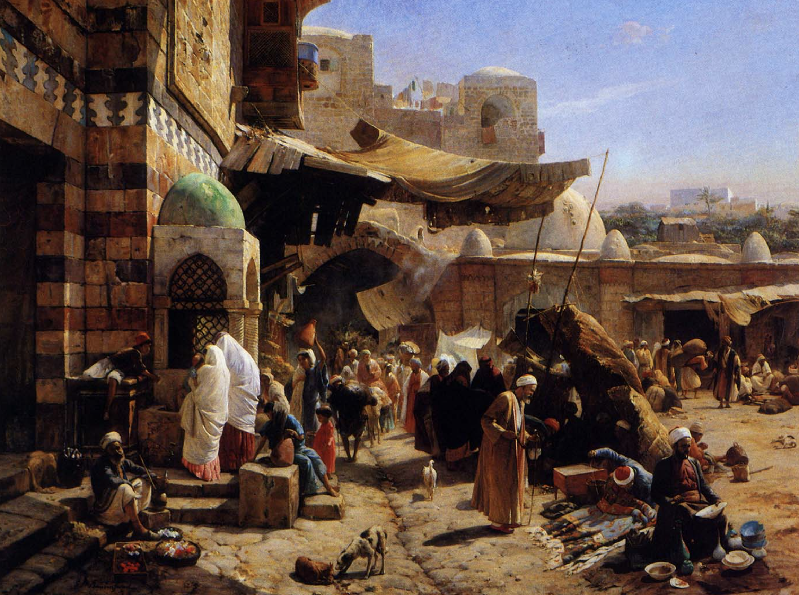

*Gustav Bauernfeind: Market at Jaffa, 1877 painting*

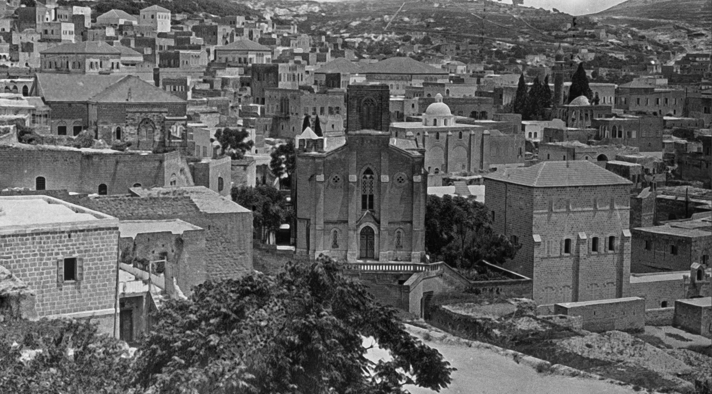

*A view of Nazareth in the 1920s. (Carl Simon / United Archives / Universal Images Group via Getty Images)*

The early 20th-century Zionist slogan *"A land without a people for a people without a land"*, whether widely used or attributed to only a few public figures, captures the essence of [Zionism](https://en.wikipedia.org/wiki/Zionism): establishing a Jewish state encompassing as much of Palestine as possible while minimizing its Palestinian population. Zionism emerged as a settler-colonial movement claiming land inhabited for millennia, justified by biblical references to the "promised land" of Zion (Mount Zion, a hill in Jerusalem). The movement sought to transform Palestine into a Jewish homeland, disregarding the existing indigenous Arab population that had lived there for over a thousand years.

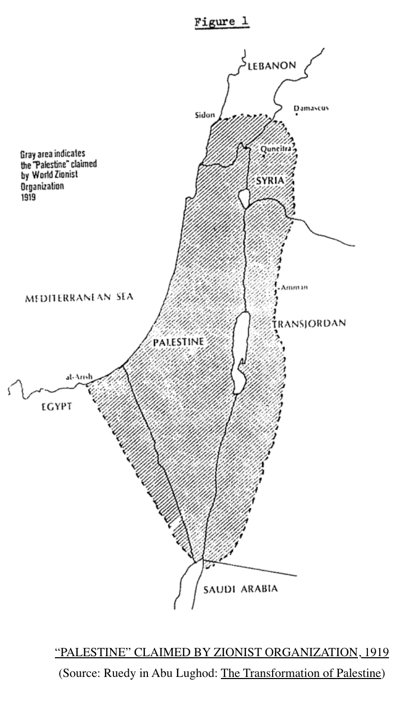

Initially a secular nationalist movement emerging in late 19th-century Central and Eastern Europe, Zionism arose with dual aims: establishing a safe haven for European Jews facing pervasive antisemitism and redefining Jewish identity in national rather than religious terms (this would change after 1948). The dominant ideology of political Zionism, championed by [Theodor Herzl](https://en.wikipedia.org/wiki/Theodor_Herzl), was fundamentally secular and lacked religious motivation. Herzl described himself as not religious and did not speak Yiddish. The World Zionist Organization at the 1897 [First Zionist Congress](https://en.wikipedia.org/wiki/First_Zionist_Congress) in Basel, Switzerland, declared its aim *"to create for the Jewish people a home in Palestine secured by public law."* Before settling on Palestine, the movement considered alternative locations including East Africa and Argentina for the proposed Jewish national home. Ultimately, Palestine was chosen and claimed as the national home based on ancient Jewish historical connections to the land, despite its existing Arab population.

The movement gained momentum also through several converging external forces: [Christian Zionism](https://en.wikipedia.org/wiki/Christian_Zionism) (whose adherents, often themselves antisemites, desired the return of Jews to the Holy Land to precipitate the Messiah's second coming), British imperial interests, and prevailing anti-Arab and anti-Muslim sentiments in the West. Notably, marginal groups within the movement advocated alternative visions. The [Ahad Ha'Amists](https://en.wikipedia.org/wiki/Cultural_Zionism) sought only a cultural center and favored Jewish-Arab coexistence (cultural Zionism), while socialist factions championed Jewish-Arab working-class cooperation to build a unified Palestine. Both opposed the establishment of an exclusionary Jewish state.

In 1917, the [Balfour Declaration](https://en.wikipedia.org/wiki/Balfour_Declaration) issued by the British government expressed support for establishing a "national home for the Jewish people" in Palestine. This seemingly generous gesture was far from altruistic: pervasive antisemitism played a significant role in Britain's support for removing Jews from Europe and backing Zionism. Equally important were strategic imperial interests, weakening the Ottoman Empire and securing an ally to protect the Suez Canal.

Palestinians initially did not revolt against the influx of Zionist settlers, likely because they failed to grasp the full implications of the declaration. The consequences became unmistakable as growing numbers of European Jewish immigrants systematically displaced Palestinian workers from the labor market. Under the British Mandate, the Jewish population surged from 57,000 to 320,000 by 1935, fundamentally altering the demographic and economic landscape of Palestine.

Between 1936 and 1939, the [Arab Revolt](https://en.wikipedia.org/wiki/1936%E2%80%931939_Arab_revolt_in_Palestine), an uprising by Palestinian peasants against British colonial rule and mass Jewish immigration, was brutally crushed by the British Empire. The suppression killed thousands and left an order of magnitude more wounded. One in ten adult Palestinian males was either killed, wounded, imprisoned, or exiled. This systematic destruction proved critical in undermining organized Palestinian resistance during the 1947-1948 ethnic cleansing that followed. As documented in [Demographics of Historic Palestine Prior to 1948](https://www.cjpme.org/fs_007), **the Jewish population in Palestine increased from approximately 5% in 1880 to roughly 30% by 1947**, while the majority remained Palestinian Arabs. The Christian population remained stable at just under 10%.

Following World War II, Jewish survivors remained confined in displaced persons camps that differed from Nazi concentration camps primarily in the absence of systematic extermination. The [Harrison Report](https://encyclopedia.ushmm.org/content/en/article/the-harrison-report), commissioned by US President Truman, documented these dire conditions. Many nations, including the United States, refused to accept Jewish refugees, a policy supported by both American Zionist organizations and segments of the American Jewish community who preferred directing survivors elsewhere. Zionist emissaries gained significant influence over these camps and advocated strongly for channeling European Jewish refugees toward Palestine rather than other destinations. This aligned with broader Western antisemitic sentiment favoring Jewish emigration from Europe. Historian Yosef Grodzinsky examined this complex and controversial period in his book [*In the Shadow of the Holocaust: The Struggle Between Jews and Zionists in the Aftermath of World War II*](https://www.goodreads.com/book/show/2267267.In_the_Shadow_of_the_Holocaust).

The Holocaust's prominence in public discourse emerged only after 1967, propelled by the Six-Day War and the Zionist Greater Israel project. Before this, Holocaust scholarship struggled for recognition. Raul Hilberg's groundbreaking work [*The Destruction of the European Jews*](https://en.wikipedia.org/wiki/The_Destruction_of_the_European_Jews) faced years of publication rejection, illustrating how the Holocaust was not initially central to either Jewish identity or Zionist advocacy.

In 1947, the British ended the Mandate in Palestine and referred the territory's future to the United Nations. The United Nations Special Committee on Palestine (UNSCOP) submitted a partition plan to the UN General Assembly, which passed [Resolution 181](https://documents.un.org/doc/resolution/gen/nr0/038/88/pdf/nr003888.pdf) later that year, despite the opposition of Palestinians and most of the Arab states forming the Arab League. Keep in mind that at the time, Palestinians occupied 90% of the land, while Jewish settlers who were mostly recent immigrants from Europe owned 7% of the private land. The UN proposed to allocate approximately 55% to the Israeli state and approximately 45% to the Arab state, with Jerusalem and Bethlehem as a separate international zone. The unfairness of such a partition implied mass dispossession and displacement of the Palestinians from their towns and villages, particularly given the openly stated Zionist objective to Judaize the territory as much as possible. This is what the partition plan looked like:

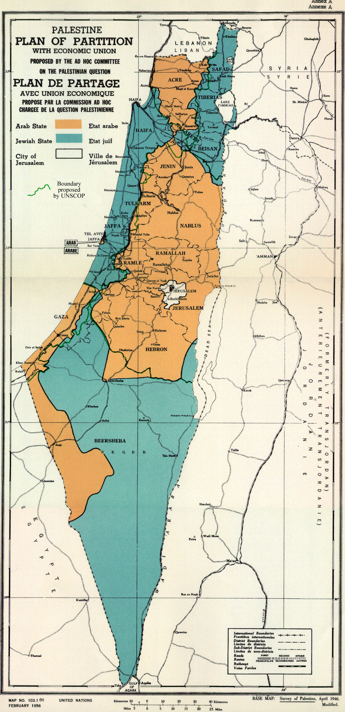

*UN partition plan for Palestine 1947*

While this expropriation was being ratified, Zionist leaders secretly met with the king of Jordan to negotiate the division of Palestinian territory between them following the end of the British Mandate.
The year that followed was catastrophic. What Israeli historiography calls the "War of Independence" was in fact a campaign of ethnic cleansing and violent displacement, the [Nakba](https://en.wikipedia.org/wiki/Nakba) (catastrophe). Palestinian military capacity was virtually non-existent, having been decimated by the British repression of the 1936-1939 Arab Revolt. The Arab League mounted resistance for several months in 1948 but was eventually overwhelmed by Western-supported Israeli military forces. These forces evolved from the Haganah, the principal Zionist paramilitary organization during the Mandate period, and employed tactics that included biological warfare (such as the [poisoning of water supplies](https://www.tandfonline.com/doi/full/10.1080/00263206.2022.2122448)). The Israeli military also brought destruction and massacres to the territory assigned to the Arab state under the UN partition plan, in direct violation of the resolution. At the end of 1948 [UN General Assembly Resolution 194](https://www.securitycouncilreport.org/un-documents/document/ip-ares-194.php) called for the return of refugees to their homes and compensation for those who chose not to return, but this was refuted by Israel. In May 1949 [UN Resolution 273](https://www.securitycouncilreport.org/un-documents/document/unmembers-ares273-iii.php) admitted the State of Israel to the UN. **The State of Palestine was never created**. 

By this point, Israel controlled approximately 80% of historic Palestine (up from the 55% allocated by the UN partition plan), while Jordan occupied the West Bank and East Jerusalem (about 20%), and Egypt took control of the Gaza Strip. The West Bank and Gaza Strip essentially were refugee camps for Palestinians expelled from their homes. Approximately 750,000 Palestinians (**75% of all Palestinians!**) were forcibly displaced or fled to these camps or to neighboring Lebanon, Egypt, and Syria. Israel refused to allow their return. Palestinian villages and towns were systematically destroyed, hundreds razed to the ground. The 150,000 Palestinians who remained within Israel's borders were subjected to martial law, which severely restricted their movement, political activity, and access to land and resources. Look at the map below, which shows the additional expansion of the State of Israel as per the [1949 Armistice Agreements (the Green Line)](https://unterm.un.org/unterm2/en/view/51c4703d-727d-494c-9ab7-f98afd9d9f77):

  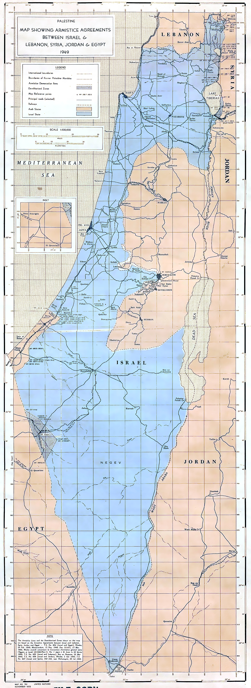
  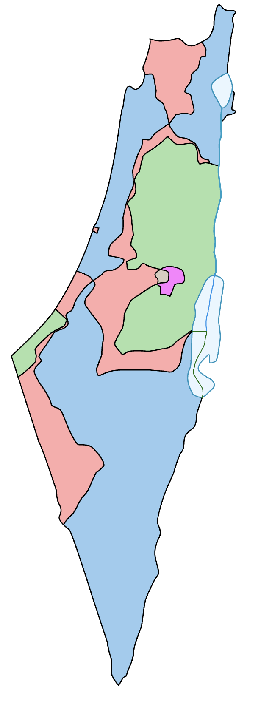

*Maps showing the territorial partition defined by the 1949 Armistice Agreements. The red areas in the right diagram represent land annexed by Israel beyond the UN partition plan, bringing Israeli control to approximately 80% of what had been Mandatory Palestine just two years prior. Critically, the continuity of the Palestinian territories was broken.*

The following table summarizes key statistics from historical research, including Ilan Pappé’s [*The Ethnic Cleansing of Palestine*](https://www.goodreads.com/book/show/57540.The_Ethnic_Cleansing_of_Palestine) and Benny Morris’s [*Righteous Victims: A History of the Zionist-Arab Conflict*](https://www.goodreads.com/book/show/131324.Righteous_Victims):

| Category | Value | Notes |
|----------|--------|-------|
| Palestinians Killed | 10,000-15,000 |  |
| Israelis Killed | ~6,000 |  |
| Palestinians Displaced | ~750,000 | Approximately 75% of the total Palestinian arab population. |
| Villages Destroyed | ~530 | Palestinian villages and urban neighborhoods depopulated and demolished. |
| Massacres | 70+ | Documented massacres of Palestinian civilians. |

Forced dispossession, displacement and ethnic cleansing of Palestinians continued after the armistice and has not stopped since. The Nakba and the international silence on the crimes committed were foundational to the racist and settler-colonial ideology on which the Jewish state was built.

### Towards Greater Israel

In the years following the armistice, thousands of Palestinians attempted to return to their homes, only to be killed by the Israeli military at the border. This period witnessed the emergence of organized Palestinian armed resistance, notably the [Fedayeen movement](https://en.wikipedia.org/wiki/Palestinian_fedayeen) and the [Palestinian Liberation Organization (PLO)](https://en.wikipedia.org/wiki/Palestine_Liberation_Organization) created in 1964. By the early 1960s, a devastating pattern had crystallized: Palestinian fighters would attack Israeli military targets and occasionally kill Israeli soldiers (at times civilians), in response, the Israeli military would collectively punish entire Palestinian communities, rounding up villagers, executing civilians, and demolishing homes, all justified under the banner of Israel's *"right to defend itself"* against terrorism. The [Qibya massacre](https://en.wikipedia.org/wiki/Qibya_massacre), led by commander Ariel Sharon (future Prime Minister), exemplifies this brutal policy, as documented by Adel Manna in [*Nakba and Survival*](https://luminosoa.org/books/m/10.1525/luminos.129). Palestinian casualties consistently outnumbered Israeli casualties by orders of magnitude, a pattern that persists today.

The West Bank and Gaza Strip soon became targets of a powerful lobby, led by military generals, that pressured Prime Minister Ben-Gurion to abandon the alliance with Jordan and pursue territorial expansion. When Ben-Gurion's administration ended and border tensions with Syria, Egypt, and Jordan intensified, the [Six-Day War](https://en.wikipedia.org/wiki/Six-Day_War) of 1967 marked a decisive turning point. Israel seized control of the West Bank, Gaza Strip, East Jerusalem, the Sinai Peninsula, and the Golan Heights. This conflict displaced approximately 300,000 additional Palestinians, most fleeing to Jordan and Syria in what became known as the [Naksa](https://en.wikipedia.org/wiki/Naksa) (the setback). The entire territory of historic Palestine now fell under Israeli military control, a devastating outcome for the Palestinian people, most of whom became refugees (one third), while the rest were living under military rule by an apartheid state. About 100,000 Syrians fled the Golan Heights. The Six-Day War resulted in more than 15,000 Arab fatalities, while Israel suffered fewer than 1,000 deaths.

| Category | Value | Notes |
|----------|--------|-------|
| Arab Combatants Killed | ~15,000 | Combined casualties from Egypt, Syria, Jordan, and other Arab forces. |
| Israeli Combatants Killed | ~1,000 | Israeli military casualties. |
| Palestinians Displaced (Naksa) | ~300,000 | Palestinians fleeing to Jordan and Syria from newly occupied territories. |
| Syrians Displaced | ~100,000 | Syrians fleeing the Golan Heights. |
| Territory Lost by Egypt | Sinai Peninsula, Gaza Strip | Sinai returned to Egypt in 1982 following Camp David Accords. |
| Territory Lost by Syria | Golan Heights | Remains occupied and annexed by Israel (unrecognized internationally). |
| Territory Lost by Jordan | West Bank, East Jerusalem | Remains occupied; East Jerusalem annexed by Israel (unrecognized internationally). |

  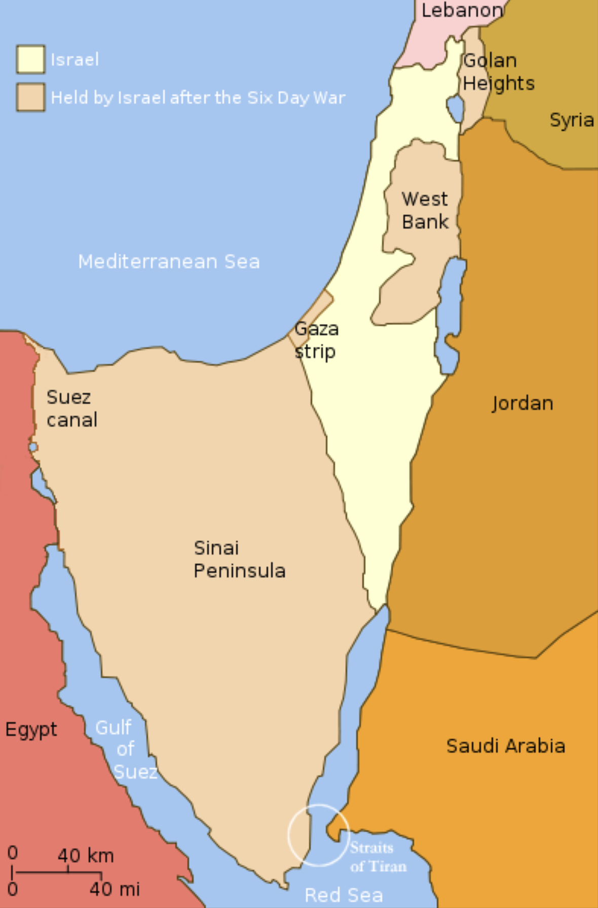
  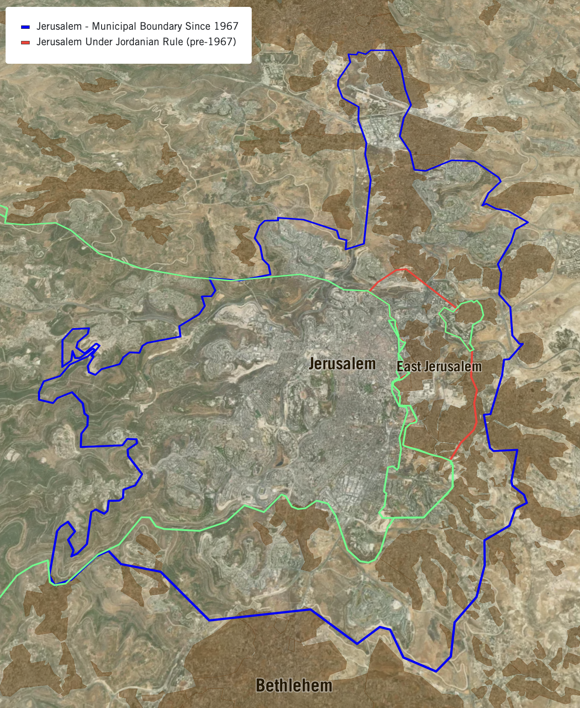

*Territory occupied by Israel after the 1967 war (left). East Jerusalem illegally annexed territory (right).*

[UN Security Council Resolution 242](https://digitallibrary.un.org/record/90717), passed unanimously in November 1967, called for Israel's withdrawal from territories occupied during the Six-Day War and affirmed the right of every state in the region to live in peace within secure and recognized boundaries, specifically, those established by the 1949 armistice agreements (the Green Line). More than five decades later, this resolution remains unfulfilled and the international consensus almost entirely does not recognize the occupied territories as part of Israel.

Noam Chomsky, in [*The Fateful Triangle*](https://yplus.ps/wp-content/uploads/2021/01/Chomsky-Noam-The-Fateful-Triangle-The-United-States-Israel-and-the-Palestinians.pdf), identifies the post-1967 period as cornerstone to understanding subsequent Israeli policy. In the months following the Six-Day War (June-August 1967), Israel's thirteenth government, representing the widest possible Zionist consensus, made a series of decisions that would condemn West Bank and Gaza Strip Palestinians to what amounts to indefinite imprisonment:

1. **No mass ethnic cleansing**, although considered as an option.
2. **No land concession for peace**: the occupied West Bank and Gaza Strip must be explicitly excluded from any peace negotiations (Golan Heights and East Jerusalem were already considered annexed).
3. **No full citizenship** for the occupied Palestinian population, maintaining Jewish demographic majority (except in the Golan Heights, annexed in 1981, and East Jerusalem, [immediately annexed](https://www.btselem.org/jerusalem), though the vast majority of residents there declined Israeli citizenship).

> **Note:** The logical consequence of these three principles was to treat Palestinians in the occupied territories as inmates in what became the largest open-air prison in modern history.

The 1967 period also marked a profound cultural transformation. Zionism evolved into a de facto state religion, fundamentally reshaping Israeli society. The war and its aftermath transformed many Israelis into ardent nationalists and fervent supporters of the Judaization of Greater Israel, including the newly invaded and occupied territories. This shift manifested in subsequent decades as Israeli policy increasingly demanded that Palestinians recognize Israel not merely as a state on what used to be their land, but specifically as a *Jewish* state. This requirement implicitly denies equal rights to non-Jewish citizens and exposes the inherently apartheid nature of the system. 

Meanwhile, the [Palestine Liberation Organization (PLO)](https://en.wikipedia.org/wiki/Palestine_Liberation_Organization) emerged as the primary representative of the Palestinian people, advocating for national rights and self-determination. Many Fedayeen groups joined the PLO after 1967 while retaining operational autonomy in their armed struggle against Zionism and Israeli occupation. Initially based in Jordan, the PLO relocated to Lebanese Palestinian refugee camps following the [Black September](https://en.wikipedia.org/wiki/Black_September) events of 1970-1971, when the Jordanian army violently suppressed Palestinian armed groups. The PLO was born from the determination to reverse the Zionist colonization of Palestine and end the occupation. This created a fundamental tension within the various factions under the PLO umbrella, including its main political party Fatah: the tension between reversing historical injustice and accepting practical political reality. This manifested as competing strategies, guerrilla warfare, attacks on civilians, and diplomatic engagement, with diplomacy gaining prominence by the mid-1970s as the organization increasingly sought international legitimacy and political solutions.

A crucial decision came in 1971 when Egyptian President Sadat offered a peace treaty in exchange for the return of the Sinai Peninsula, which Israel had begun settling. However, the Israeli government under Prime Minister Golda Meir, with support from US Secretary of State Henry Kissinger, rejected the proposal. Israel prioritized territorial expansion over security, a decision whose implications were profound: accepting Egypt's peace offer would have substantially enhanced Israel's security, yet the government chose otherwise. This rejection set the stage for the [Yom Kippur War](https://en.wikipedia.org/wiki/Yom_Kippur_War) of 1973, in which Egypt and Syria sought to reclaim the Sinai Peninsula and Golan Heights respectively.

This decision proved pivotal for future Israeli policy, favoring territorial acquisition over security and peace, particularly significant given Egypt's status as the most powerful Arab military force. Chomsky describes this decision as *"fateful"* as it cemented Israel's trajectory toward perpetual occupation and expansion, fundamentally undermining claims that its actions are primarily defensive. While adherence to international law would likely ensure much greater security and peace, it would make the Zionist Greater Israel project unrealizable.

In 1973, [UN Security Council Resolution 338](https://www.securitycouncilreport.org/atf/cf/%7B65BFCF9B-6D27-4E9C-8CD3-CF6E4FF96FF9%7D/Golan%20Heights%20SRES338.pdf) passed with near-unanimous support, calling for a ceasefire in the Yom Kippur War and demanding that Israel implement Resolution 242 by withdrawing from territories occupied in 1967. The resolution also mandated immediate negotiations toward a lasting peace. The Geneva Conference later that year attempted to advance these objectives but quickly reached an impasse.

In 1974, PLO leader Yasser Arafat delivered a [historic address to the UN General Assembly](https://www.palquest.org/en/historictext/9639/speech-yasir-arafat-unga), asserting the Palestinian right to self-determination and advocating for a single democratic state encompassing all inhabitants. He invoked the vision of Jewish revolutionary Ahud Adif, who had championed Arab-Jewish cohabitation. However, Arafat did not yet endorse Resolutions 242 and 338, a position he would reverse in 1988. Meanwhile, Israeli Prime Minister Yitzhak Rabin of the Labor Party explicitly opposed establishing a Palestinian state between Israel and Jordan and refused negotiations with the PLO, positions formalized through Knesset resolutions.

Two years later, a [1976 UN Security Council draft resolution](https://www.un.org/unispal/document/auto-insert-189673/) called for precisely this: a two-state settlement on internationally recognized borders, Israeli withdrawal from territories occupied in 1967, formation of an independent Palestinian state, and the right of return for Palestinian refugees. The United States vetoed this resolution, dismissing it as *"totally devoid of balance"* despite its alignment with international law and broad international support, including from the PLO.

The [Camp David Accords](https://en.wikipedia.org/wiki/Camp_David_Accords) of 1978, brokered by US President Carter between Israeli Prime Minister Begin and Egyptian President Sadat, led to a [1979 peace treaty](https://en.wikipedia.org/wiki/Egypt%E2%80%93Israel_peace_treaty) that returned the Sinai Peninsula to Egypt (completed in 1982). However, this bilateral agreement entirely sidestepped the Palestinian question, establishing a pattern of US-brokered "peace" that excluded Palestinians and bypassed international consensus and UN frameworks, the "Pax Americana" approach. 

Of course, Begin and Sadat were awarded [the 1978 Nobel Peace Prize](https://www.nobelprize.org/prizes/peace/1978/summary/). 🤮

The Camp David Accords sparked widespread condemnation from the UN General Assembly and Arab nations (with the exception of Egypt) for excluding Palestinians from determining their own future. Arguably the proposal of "autonomous zones" for Palestinians in the West Bank and Gaza Strip was marketing speak for open-air prisons.

This rejectionist policy (rejecting Palestinian rights and the international consensus on peace expressed in UN Security Council Resolution draft resolution of 1976) received substantial US government support throughout the 1970s and beyond. The United States had assumed the European imperial mantle globally well before this period, including in the Middle East, providing Israel with military, financial, and diplomatic backing. Military support ensured Israeli dominance over Arab countries and counterbalanced Soviet support to Arab states, positioning the conflict within the broader US-USSR imperial rivalry. Diplomatic support effectively granted Israel impunity to pursue its expansionist agenda, with the US routinely vetoing UN Security Council resolutions condemning Israeli violations of international law.

Despite Israeli efforts to portray the PLO as merely a terrorist organization and Arab states as obstacles to peace, the reality on the ground revealed the true nature of Israeli policy. Immediately after 1967, Israeli settlements and military zones aimed at precluding access to water and natural resources expanded significantly across the occupied Syrian Golan Heights, West Bank, East Jerusalem, and Gaza Strip, systematically implementing the Greater Israel vision through incremental territorial appropriation.

### The Right to Defend Itself

The settler-colonization of the West Bank and Golan Heights accelerated sharply with the backing of the Reagan administration in the United States. By the mid-1980s, Israel aimed to settle 100,000 Israelis in the West Bank by 1986, as documented by Jerusalem Deputy Mayor Meron Benvenisti’s [extensive research](https://www.nytimes.com/1985/02/10/world/jewish-settlers-are-put-at-42500.html). Beginning in 1979, the Israeli government systematically declared large areas of the West Bank as "state land" enabling the expropriation of Palestinian territory for Jewish settlements and military zones. The map below, provided by the Israeli human rights organization [B'Tselem](https://www.btselem.org/), illustrates the classification of West Bank land until 1993 into [state land](https://www.btselem.org/publications/summaries/201203_under_the_guise_of_legality), [nature reserves](https://www.btselem.org/jerusalem/national_parks), [closed military zones](https://www.keremnavot.org/_files/ugd/a76eb4_effeae08cbc9492fb589419b6348373c.pdf), and [settlements](https://www.btselem.org/settlements), achieving [demographic and geographic conditions](https://www.btselem.org/publications/summaries/200205_land_grab) that would obstruct any future attempts to question Israeli dominance, foreshadowing the Oslo Accords division. B'Tselem maintains comprehensive databases on fatalities, house demolitions, statistics, and interactive maps, [historical context](https://conquer-and-divide.btselem.org/map-en.html), offering valuable insight into the ongoing realities of occupation and settlement expansion.

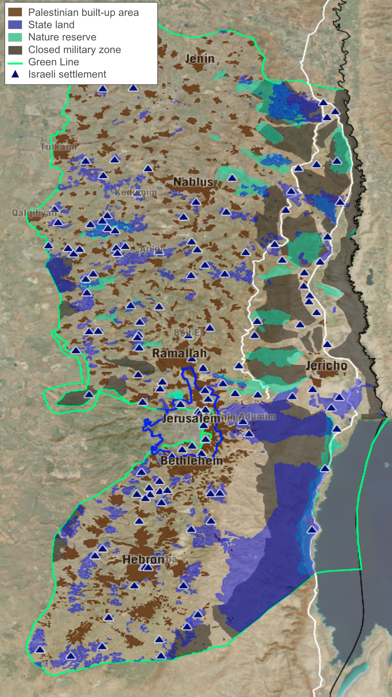

*From 1979 to 1992, 90,000 hectares were declared state land and allocated to settlements. The resemblance to the future Oslo Accords division is striking.*

In 1981, Defense Minister Ariel Sharon and civilian administrator Menachem Milson instituted a regime of terror in the West Bank and Gaza that many observers compared to South African apartheid and the bantustan system (which notably had no international support apart from the USA and the UK). That same year, the Israeli government extended civilian administration to the Golan Heights, effectively annexing the territory, a move widely condemned by the international community. The 1982 withdrawal from Sinai, framed as a national trauma and the rallying cry of *"Never Again"* further hardened Israeli resistance to future territorial concessions and entrenched the settlement enterprise across the occupied territories.

The 1982 invasion of Lebanon, known as [Operation Peace for Galilee](https://en.wikipedia.org/wiki/1982_Lebanon_War), unfolded against the backdrop of a [brutal civil war](https://en.wikipedia.org/wiki/Lebanese_Civil_War) and years of strategic planning by Israeli leadership, particularly Ariel Sharon. The primary objectives were to dismantle the PLO, which had established its base in Lebanon and was actively resisting Israeli occupation and apartheid policies. Secondly, intervention in Lebanon's civil war to install a Christian government favorable to Israeli interests. While the official pretext for the invasion was the attempted assassination of the Israeli ambassador in London by the Abu Nidal organization, a rival Palestinian faction hostile to the PLO, this justification obscured a broader context of escalating tensions, including repeated Israeli military provocations in Lebanese airspace and territorial waters. Israeli Prime Minister Begin (the Nobel Peace Prize winner) presented the operation as a defensive measure to protect northern Israel from terrorist attacks. However, the scale of the invasion, culminating in the siege and bombardment of Beirut, revealed plainly aggressive motives. The war resulted in massive civilian casualties, with [estimates](https://www.washingtonpost.com/archive/politics/1982/09/03/war-casualties-put-at-48000-in-lebanon/cf593941-6067-4239-a453-71bdcaf9eba0/) of around 17,000 killed and 30,000 injured, mostly civilians. Less than 1000 IDF soldiers were killed. 

| Category | Value | Notes |
|----------|--------|-------|
| Lebanese Civilians Killed | ~15,000-17,000 | Majority of total casualties were Lebanese civilians. |
| Sabra and Shatila Massacre | ~2,000-3,500 | Palestinian refugees. |
| Syrian Combatants Killed | ~1,000 | Syrian forces stationed in Lebanon. |
| PLO Combatants Killed | ~1,000 |  |
| Israeli Combatants Killed | ~657 |  |
| Total Injured | ~30,000+ | Predominantly Lebanese and Palestinian civilians. |
| Displaced | ~600,000 | Lebanese and Palestinian refugees displaced by the invasion. |

The [Sabra and Shatila massacres](https://en.wikipedia.org/wiki/Sabra_and_Shatila_massacre) took place in September 1982, when Lebanese Christian militias, with direct complicity from the Israeli military, killed thousands of Palestinian refugees in Beirut. Over the course of three days, civilians in the Sabra and Shatila camps were systematically slaughtered while Israeli forces surrounded and sealed off the area, preventing escape or outside intervention. The operation was officially justified as a search for "terrorists" allegedly hiding among the refugees, a claim frequently invoked to legitimize collective punishment and atrocities. The massacre stands as a stark illustration of the brutality and impunity that characterized Israeli actions, consolidating a pattern that unfortunately only escalated in the years that followed. Even the American media had a hard time not to be astonished by the scale of the aggression and violence perpetrated by Israel. Many reports from major news outlets were showing the destruction on TV, and rhetorically asking if this was an imperial war. Time Magazine exposed Sharon and Begin in a [front page article](https://content.time.com/time/covers/0,16641,19830221,00.html).

The [First Intifada](https://en.wikipedia.org/wiki/First_Intifada) (1987–1993) was a mass Palestinian uprising against Israeli occupation and apartheid in the West Bank and Gaza Strip. It began as a grassroots movement characterized by widespread civil disobedience: general strikes, boycotts of Israeli goods, refusal to pay taxes, and large-scale demonstrations. While most actions were nonviolent, the Intifada also included violent confrontations and attacks by Palestinian armed groups targeting Israeli soldiers and, at times, civilians. The Israeli military, under Defense Minister Yitzhak Rabin, responded with brutal repression, mass arrests, [systematic torture](https://www.theguardian.com/world/2000/feb/11/israel), expulsions, demolition of homes, and the use of live ammunition against protesters, including children. As customary, [casualty figures](https://www.btselem.org/statistics/first_intifada_tables) were heavily skewed:

| Category | Value | Notes |
|----------|--------|-------|
| Palestinians Killed | ~1,300 | Approximately 25% were children under 17. |
| Israelis Killed | ~170 | Soldiers and civilians, 3 children. |
| Palestinians Injured | ~100,000 | Predominantly from live ammunition, beatings, tear gas. |
| Israelis Injured | ~3,000 | Soldiers and civilians. |
| Palestinians Arrested | ~120,000 | [Spent variable time in Israeli prisons.](https://www.washingtonpost.com/archive/politics/1995/10/03/palestinians-await-release-of-prisoners/fb9ba469-1faf-431e-a0ca-628505bf784c/) |

Meanwhile, the Jewish settler population in the West Bank grew rapidly through the continuous establishment of new settlements and the systematic dispossession of Palestinians. As documented by [Benny Morris](https://www.goodreads.com/book/show/131324.Righteous_Victims), the settler population doubled roughly every four years, reaching about 130,000 by the mid-1990s. Following the 1991 Gulf War, Israel imposed severe [restrictions on Palestinian movement](https://www.btselem.org/freedom_of_movement) into Israel and East Jerusalem, ostensibly for security reasons, which effectively fragmented the West Bank, East Jerusalem, and the Gaza Strip into isolated enclaves, making travel between them extremely difficult for Palestinians.

As documented by Rashid Khalidi in [*Palestinian Identity: The Construction of Modern National Consciousness*](https://www.goodreads.com/book/show/20249639), the Intifada marked a significant shift in Palestinian resistance, galvanizing international attention and support for their cause. The brutality of the response drew international condemnation and increased pressure on the United States to push for negotiations with the PLO, which gradually moved toward [accepting UN resolutions (181, 242, 338) and the two-state solution framework](https://www.palquest.org/en/historictext/9679/press-conference-statement-yasir-arafat-clarifying-his-speech-un-general-assembly). At the end of 1988 the UN General Assembly passed [Resolution 43/177](https://docs.un.org/en/a/res/43/177), recognizing the PLO as the *"representative of the Palestinian people"*, the proclamation of the State of Palestine over the territorial boundaries of Resolution 242, prior to the 1967 Israeli occupation and calling for the implementation of resolution 181 (the partition plan). **The US and Israel were the only states which voted against**, effectively blocking the implementation of a clearly stated peace framework that had international support, including that of the PLO. 

The result of the sustained rejection of the peace resolutions was the [Oslo Accords](https://en.wikipedia.org/wiki/Oslo_Accords) of 1993, a series of agreements between Israel and the PLO that [established the Palestinian Authority](https://peacemaker.un.org/sites/default/files/document/files/2024/05/il20ps940504agreement20on20the20gaza20strip20and20the20jericho20area2028cairo20agreement29.pdf) and set a framework for future negotiations. These accords were presented to the world as a realistic peace process (clearly in opposition to that of the UN and the rest of the world), brokered by the Clinton administration. However, it was immediately clear that they represented a PLO capitulation and a victory for US-Israeli rejectionism. Although the accords referenced the gradual implementation of Resolutions 242 and 338, they ignored critical aspects, such as the right of self-determination for Palestinians and the right of return or compensation for refugees, both of which had international support and were key elements of the earlier UN peace framework. Instead, the accords focused on limited Palestinian self-rule in fragmented enclaves, lacking control over borders, resource (notably water), and infrastructure. The 1995 division of the [West Bank into Areas A, B, and C](https://en.wikipedia.org/wiki/West_Bank_areas_in_the_Oslo_II_Accord) entrenched this fragmentation:

| Zone          | % Land        | Notes |
|---------------|---------------|-------|
| Zone A        | 1%–3%         | Full Palestinian control. Primarily municipal areas of exclusively Palestinian towns. |
| Zone B        | ~30%          | Palestinian administration, Israeli security control. |
| Zone C        | ~60%          | Full Israeli control and practically off-limits to Palestinians. Includes all Jewish settlements, major infrastructure, and resources. |

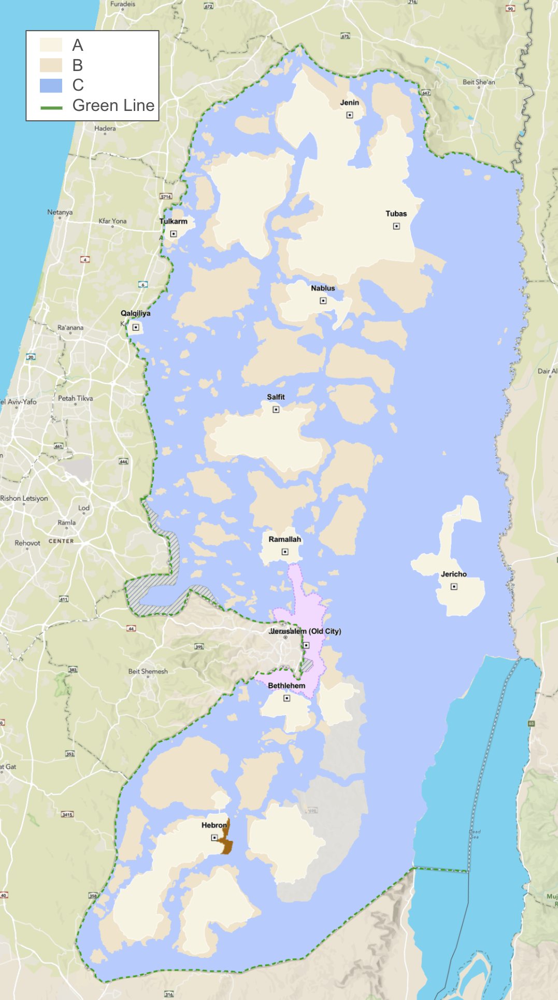

*West Bank partition in areas A, B, C. Source: [UN OCHA](https://www.ochaopt.org/maps)*

In contrast to the stated intention of fulfilling UN Resolutions 242 and 338, this partition of the West Bank further entrenched Israeli control and fragmented Palestinian governance, making the prospect of a viable Palestinian state increasingly unattainable. The Oslo process failed to halt settlement expansion, which continued unabated and further undermined the possibility of a two-state solution based on pre-1967 borders. This reality essentially followed the expansionist plan of ultra-right general Ariel Sharon, already outlined in 1981 during preparations for the Lebanon invasion. 

Predictably, Arafat, Peres, and Rabin received the [Nobel Peace Prize in 1994](https://www.nobelprize.org/prizes/peace/1994/summary/). 🤮

Arafat's acceptance of the Oslo Accords was widely perceived by Palestinians as a betrayal of the PLO’s position of seeking mutual recognition in a two-state settlement. Many saw it as capitulation to the Zionist objective of reducing Palestinians to a fragmented and powerless nation, a sentiment sharply articulated by Edward Said in his [critique of the Oslo Accords](https://www.jewishvoiceforpeace.org/wp-content/uploads/2016/06/Edward-Said-%C2%B7-The-Morning-After-%C2%B7-LRB-21-October-1993.pdf).

> *"The PLO will thus become Israel's enforcer"*
>
> *"To throw oneself, as Arafat has done, on the tender mercies of the US is almost certainly to
suffer the fate the US has meted out to rebellious or ‘terrorist’ peoples it has had to deal with
in the Third World after they have promised not to resist the US any more" (referring to Vietnam, Nicaragua, El Salvador, Haiti)*
>
> — Edward Said, *The Morning After* (1993)

The resulting map of the West Bank, post-Oslo, is often described as *“an archipelago of islands”*. What in the map above looks like water is instead contiguous territory under total Israeli control, practically off-limits to Palestinians, rendering Palestinian areas isolated and disconnected.  
Over in the Gaza Strip, freedom of movement and commerce suffered a similar fate, with the construction of a perimeter fence and strict Israeli control over borders, airspace, and maritime access. People and goods could only get into and out of Gaza via the crossings only after obtaining the necessary permits from Israel.

Can you build a nation under these conditions?

It became increasingly clear that Israel had no intention of halting settlement expansion or ending the dispossession of Palestinians, especially under the leadership of Prime Minister Benjamin Netanyahu (1996–1999, Likud).  Security threats were routinely invoked to justify these policies to both domestic and international audiences. The Oslo Accords struggled to be implemented, and the [Camp David negotiations](https://en.wikipedia.org/wiki/2000_Camp_David_Summit) in the summer of 2000, a last-ditch effort between Arafat and Ehud Barak, failed to resolve final status issues. 

In early 2001, the [Taba negotiations](https://en.wikipedia.org/wiki/Taba_Summit), brokered by President Clinton, brought Israel and the PLO closer than ever to a final status agreement. However, the talks were abruptly canceled by Israeli Prime Minister Ehud Barak. The subsequent Sharon’s administration immediately abandoned the negotiation process and intensified military operations in the occupied territories, fueling the cycle of violence and repression. As Noam Chomsky observed in [*Gaza in Crisis*](https://www.goodreads.com/book/show/8491860-gaza-in-crisis), the Taba talks represented the *"sole US departure from extreme rejectionism in the past thirty years"* and came closer than any previous effort to a settlement aligned with the international consensus.

A popular revolt known as the [Second Intifada](https://en.wikipedia.org/wiki/Second_Intifada) erupted in late 2000 as a direct response to frustration with the PLO's capitulation over the previous five years and the persistent denial of Palestinian rights. The uprising quickly escalated into widespread violence: [Palestinian suicide attacks](https://en.wikipedia.org/wiki/List_of_Palestinian_suicide_attacks) surged, with nearly half occurring in East Jerusalem, while Israeli military repression under Prime Minister Ariel Sharon reached unprecedented levels. The IDF responded with disproportionate brutality, including sniper killings, prolonged sieges of towns, and tank artillery that devastated entire neighborhoods. Both [Amnesty International](https://www.amnesty.org/en/documents/mde15/149/2002/en/) and [Human Rights Watch](https://www.hrw.org/reports/2002/israel3/israel0502.pdf) extensively documented and condemned numerous war crimes committed by the Israeli military during this period. Israeli and Western media, operating in full [Hasbara](https://en.wikipedia.org/wiki/Hasbara) mode, framed the violence as Israel's *"right to defend itself"*, providing a shield of impunity and shaping public perception, while omitting discussion of the obvious solution to Israel's security: withdrawal from the occupied Palestinian territories. During the five years of the Second Intifada (2000–2005), approximately 3,000 Palestinians and 1,000 Israelis were killed.

Israel planned the construction of a 700 km-long [wall](https://en.wikipedia.org/wiki/West_Bank_barrier) in and around the West Bank, further encircling Palestinian bantustans, restricting movement of people and goods, and practically annexing land, all under the guise of security. Between 2002 and 2005, 150 km were built. By 2016 East Jerusalem was fully surrounded by a high concrete wall.  The [ICJ ruled against](https://www.icj-cij.org/case/131) the construction of this wall and deemed it illegal under international law. Checkpoints and barriers to restrict even further the movement of Palestinians proliferated throughout the West Bank.

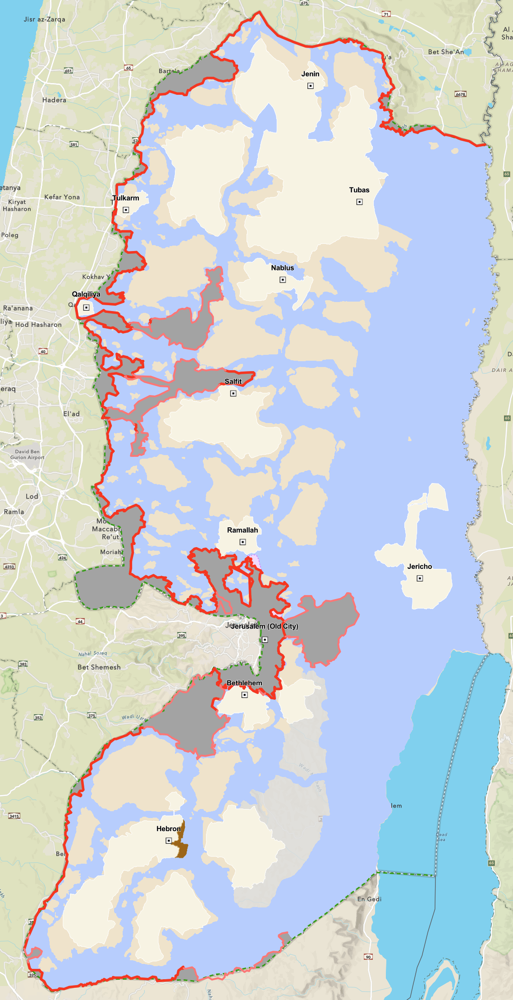

*The red line marks Israel's separation wall plan. 85% of it lies within the West Bank.*

Arafat died in 2004, and the Palestinian Authority (PA), led by Mahmoud Abbas (Abu Mazen), became the diplomatic figurehead for negotiating an end to the violence. In 2005, Israel unilaterally withdrew IDF troops from the Gaza Strip and rapidly dismantled all Jewish settlements there (21 settlements with about 8,000 settlers), forcefully relocating those unwilling to accept subsidies to move to Israel proper. This withdrawal was framed as a magnanimous gesture toward peace. The televised removal of settlers revived the same Israeli public resentment and the cry of *"Never again"* that followed the Sinai withdrawal in 1982. However, the real intentions were made clear by Dov Weissglass, Sharon's adviser at the time, who, speaking with [Haaretz journalists](https://www.haaretz.com/2004-10-06/ty-article/u-s-asks-israel-to-clarify-comments-made-by-top-pm-aide/0000017f-e4e4-df2c-a1ff-fef555650000) and reported by many major newspapers, stated:

> *The significance of the disengagement plan is the freezing of the peace process, and when you freeze that process, you prevent the establishment of a Palestinian state, and you prevent a discussion on the refugees, the borders and Jerusalem. Effectively, this whole package called the Palestinian state, with all that it entails, has been removed indefinitely from our agenda. And all this with authority and permission. All with a presidential blessing and the ratification of both houses of Congress. That is exactly what happened. You know, the term 'peace process' is a bundle of concepts and commitments. The peace process is the establishment of a Palestinian state with all the security risks that entails. The peace process is the evacuation of settlements, it's the return of refugees, it's the partition of Jerusalem. And all that has now been frozen.... what I effectively agreed to with the Americans was that part of the settlements would not be dealt with at all, and the rest will not be dealt with until the Palestinians turn into Finns. That is the significance of what we did.*

It speaks for itself. Although it may seem surprising that a top negotiator would openly admit the rejectionist stance (block the peace process and the Palestinian state) to the Israeli press, it is consistent with the broader pattern of Israeli public relations: actions are often denied or justified with deceitful rhetoric for international audiences, while true intentions are more openly acknowledged domestically, where they receive widespread support. The removal of Israeli settlers and troops from within the Gaza Strip made it even easier to treat Gaza as both a prison and a military target. Crucially, Israel’s military control over Gaza from the outside, by land, air, and sea, was not dismantled; in fact, it was intensified. This strategic shift to external control was also a response to the determined resistance of the Hamas movement, which was rapidly growing in popularity among Palestinians in Gaza.

In January 2006, elections for the Palestinian Legislative Council, the legislature of the Palestinian Authority, resulted in a victory for Hamas over the US-backed Fatah leader, Mahmoud Abbas. Notably, a large presence of international observers (EU, US, etc.) [reported](https://web.archive.org/web/20160304023813/https://www.ndi.org/files/2068_ps_elect_012506.pdf) that the elections were free and fair. However, as Chomsky observes, *"they voted the wrong way"* and *"the United States supports democracy if and only if it conforms to US strategic and economic interests."* The US/Israeli assault on Gaza began immediately. The siege of Gaza intensified, restricting water, electricity, fishing, food, medicine, and PA funds, and Fatah was armed and trained in an effort to overturn the election results by means of a civil war.

In June 2006, Israel launched [Operation Summer Rains](https://electronicintifada.net/content/palestinian-death-toll-reaches-202-operation-summer-rains-extends-its-tenth-week/2729), a large-scale military offensive in Gaza that included airstrikes, artillery bombardments, and ground incursions. This came just months after Israel had showcased its military withdrawal from Gaza. The stated pretext was the capture of one Israeli soldier by Hamas militants, while thousands of Palestinians were being held in Israeli jails without trial. As expected, the operation resulted in Palestinian deaths and injuries at rates two orders of magnitude higher than Israeli casualties (primarily soldiers), along with extensive damage to infrastructure and homes in Gaza.

| Category | Value | Notes |
|----------|--------|-------|
| Palestinian Killed | ~400 | Half of the casualties were civilians, many children. |      
| Israeli Killed | 11 | |

At the same time (summer 2006), Israel invaded Lebanon for the third time (1978, 1982). The pretext was again that Hezbollah captured soldiers, in an attempt to exchange prisoners, which needed to be freed. The [2006 Lebanon War](https://en.wikipedia.org/wiki/2006_Lebanon_War) lasted a month, resulting in [disproportionate casualties and destruction to Lebanese civilian infrastructure](http://news.bbc.co.uk/2/shared/bsp/hi/pdfs/21_11_06_amnesty.pdf). 

| Category | Value | Notes |
|----------|--------|-------|
| Lebanese Killed | ~1,500 | ~1200 civilians, ~300 Hezbollah fighters. |
| Israelis Killed | ~160 | ~120 military, ~40 civilians. |
| Displaced | ~1,000,000 | Lebanese civilians displaced by the invasion. |

The war ended with a [UN-brokered ceasefire](https://unsco.unmissions.org/sites/default/files/s_res_17012006.pdf), but the underlying issues remained unresolved. 

Despite the aggressions of 2006–2007, Hamas retained control of Gaza, and, understandably, its support among Palestinians increased. After a failed coup in the summer of 2007, which aimed to overthrow the Hamas government and install Fatah strongman Muhammad Dahlan, Israel imposed a complete blockade on Gaza. Amos Yadlin, head of Israeli military intelligence, [said](https://archive.is/IMPo2) that Israel would be happy if Hamas took over Gaza because the Israeli army could then deal with Gaza as a hostile state. The prison was now sealed off under the pretext of *"the right to defend itself"*.

### Mowing the Lawn - Incremental Genocide

What followed was the escalation of a pattern of deceit and violence that has repeated with increasing brutality and destruction until now, often described as *"mowing the lawn"*: the jailer carpet-bombing the concentration camp population and blaming the prisoners for violence and hatred. The official justification, security, is transparently false; the underlying motive is to maintain absolute control and deter any future resistance.

These cycles of aggression typically unfolded as follows:

1. **Meticulous planning:** Israeli military and political leaders prepare military and propaganda strategy months in advance, coordinating with the US government for diplomatic support and military aid.
2. **Pretext:** Israel cites rockets from Gaza targeting surrounding military installations and civilian settlements, framing them as unprovoked and driven by pure evil and desire to destroy Israel.
3. **Right to defend itself:** Israel asserts that destroying Hamas is the only solution to these attacks, invoking its right to self-defense by using military aggression.
4. **Ceasefire rejection:** Initial ceasefires, often respected by Hamas, are broken by Israeli military actions.
5. **Large-scale bombing:** Israel launches disproportionate military campaigns in Gaza, resulting in extensive destruction of infrastructure, high civilian casualties, and a permanent humanitarian crisis.
6. **Impunity:** War crimes and acts with genocidal implications are documented and denounced, but rarely punished, further expanding the boundaries of impunity.

The *"Dahiya Doctrine"*, named after the Beirut neighborhood leveled by Israeli forces in 2006, exemplifies the strategy outlined in point 5. This doctrine calls for the use of overwhelming military force against civilian infrastructure as a means of deterring future resistance. Former Israeli general and politician [Gadi Eizenkot described this approach](https://www.reuters.com/article/economy/israel-warns-hezbollah-war-would-invite-destruction-idUSL3251393/) with stark clarity:

> *"What happened in the Dahiya quarter of Beirut in 2006 will happen in every village from which Israel is fired on."*
>
> *"We will apply disproportionate force on it (village) and cause great damage and destruction there. From our standpoint, these are not civilian villages, they are military bases."*
>
> *"This is not a recommendation. This is a plan. And it has been approved."*
>
> — Gadi Eizenkot, IDF Chief of Staff (2008)

Israeli Colonel Gabi Siboni reinforced this doctrine in an [article published by the Israeli Institute for National Security Studies](https://www.inss.org.il/publication/disproportionate-force-israels-concept-of-response-in-light-of-the-second-lebanon-war/), advocating for:

> *"Force that is disproportionate to the enemy's actions and the threat it poses... meant to inflict damage to an extent that will demand long and expensive reconstruction processes."*
>
> — Gabi Siboni, Israeli Institute for National Security Studies

Needless to say, international law expressly prohibits the use of disproportionate force and the targeting of civilians and civilian infrastructure, both of which are considered war crimes. [Article 51](https://ihl-databases.icrc.org/en/ihl-treaties/api-1977/article-51) of the Fourth Geneva Convention prohibits attacks *“which may be expected to cause incidental loss of civilian life, injury to civilians, damage to civilian objects, or a combination thereof, which would be excessive in relation to the concrete and direct military advantage anticipated.”*

In December 2008 and January 2009, [Operation Cast Lead](https://en.wikipedia.org/wiki/Operation_Cast_Lead) was launched against Gaza, a two-month period marked by devastating casualties and destruction, as documented by the [2009 UN Human Rights Council report](https://www2.ohchr.org/english/bodies/hrcouncil/docs/12session/a-hrc-12-48.pdf) and [Amnesty International](https://www.amnesty.org/en/wp-content/uploads/2021/07/mde150072009en.pdf). The attack systematically destroyed means of life, civilian infrastructure (schools, hospitals, universities, mosques, farms, power, water, sewage,  etc.), sometimes using US-made white phosphorus shells in densely populated areas. What reasonable person could possibly justify this level of destruction and loss of life as self-defense?

| Category | Value | Notes |
|----------|--------|-------|
| Palestinians Killed | ~ 1,400 | Approximately 85% civilians, 300 children. |
| Israelis Killed | 13 | 3 civilians and 10 soldiers |
| Palestinians Injured | ~5,300 | Predominantly civilians. |
| Israelis Injured | ~518 | Including civilians from rocket attacks. |

Between Operation Cast Lead and the end of 2012, approximately 330 Palestinians were killed by the Israeli military, compared to 20 Israelis ([B'Tselem statistics](https://web.archive.org/web/20130308112551/http://www.btselem.org/statistics/fatalities/after-cast-lead/by-date-of-event)). True to form, the Nobel Peace Prize committee awarded the [2009 peace prize to Barack Obama](https://www.nobelprize.org/prizes/peace/2009/summary/). 🤮

In November 2012, Israel launched [Operation Pillar of Defense](https://en.wikipedia.org/wiki/2012_Gaza_War). This escalation was immediately preceded by the [assassination of Ahmed Jabari](https://www.aljazeera.com/news/2012/11/14/hamas-military-chief-killed-in-israeli-attack), a senior official in the military wing of Hamas who had been working with the Israeli military to establish a permanent truce. Israeli peace activist [Gershon Baskin reported](https://gershonbaskin.org/interviews/ahmed-jabari-1960-2012/) that Jabari was killed just hours before he was set to receive the draft of a truce agreement with Israel, which included mechanisms for maintaining a ceasefire.

| Category | Value | Notes |
|----------|--------|-------|
| Palestinians Killed | ~170 | Half civilians, 35 children. |
| Israelis Killed | 6 | 4 civilians and 2 soldiers. |
| Palestinians Injured | ~1,200 | Predominantly civilians. |
| Israelis Injured | ~240 | Including civilians from rocket attacks. |

Following the operation, a ceasefire agreement was reached, which followed the standard terms of previous agreements: cessation of military action by both sides and the effective ending of the siege of Gaza. This included Israel opening the crossings, facilitating the movement of people and goods, and refraining from restricting residents’ free movement or targeting residents in border areas. Nathan Thrall, a prominent Middle East analyst, writing for the [London Review of Books](https://www.lrb.co.uk/the-paper/v36/n16/nathan-thrall/hamas-s-chances), observed that the Shin Bet (Israel Security Agency) was impressed by Hamas's respect for the ceasefire, so the IDF had little incentive to uphold their commitment and entered Gaza numerous times, strafed farmers, and shot at fishermen.

The siege of the Gaza Strip and repeated violations of ceasefires persisted until April 2014, when Fatah and Hamas signed a unity agreement and formed a national unity government led by Mahmoud Abbas. Predictably, this attempt to unify the occupied territories under a single administration was met with immediate and intense hostility from Israel, as it undermined Israel's claim that it could not negotiate with a divided entity and threatened its long-term goal of separating Gaza from the West Bank to pursue destructive policies in both regions. Within months, Israel launched another major military offensive, [Operation Protective Edge](https://en.wikipedia.org/wiki/2014_Gaza_War), in July and August 2014, escalating the pattern of "mowing the lawn": large-scale bombardment of Gaza, widespread destruction of civilian infrastructure, and devastating loss of life. The pretext in this case was the kidnapping and then murder of three Israeli boys in a West Bank settlement, which Prime Minister Benjamin Netanyahu claimed was the work of Hamas; in reality, it was perpetrated by the Qawasmeh clan in Hebron. This was likely a reprisal for the murder by an IDF sniper of two Palestinian teenagers in the West Bank town of Beitunia, captured on [CCTV](https://www.theguardian.com/world/video/2014/may/20/cctv-footage-palestinian-teenagers-shot-dead-video), along with various other similar episodes in the preceding months and years. Israel launched an eighteen-day rampage following the kidnapping, which succeeded in undermining the feared unity government, taking hundreds prisoners (or should we say hostages?), killing some civilians in the West Bank and the Gaza Strip. Eventually Hamas fired rockets from Gaza and the Israeli military operation began the day after. The casualties from Operation Protective Edge, as documented by [B'Tselem](https://www.btselem.org/2014_gaza_conflict/en/), were again disproportionately horrendous:

| Category | Value | Notes |
|----------|--------|-------|
| Palestinians Killed | ~2,250 | 65% of these were civilians, 550 children. |
| Israelis Killed | 73 | 67 soldiers and 6 civilians. |
| Palestinians Injured | ~11,000 | Predominantly civilians, many with permanent disabilities. |
| Israelis Injured | ~1,600 | Including civilians and soldiers. |
| Gaza Homes Destroyed | ~18,000 | Palestinian homes completely destroyed or severely damaged. |
| Gaza Citizens Displaced | ~100,000 |  |

Vast swathes of Gaza were reduced to rubble. Four hospitals were targeted and damaged, acts that constitute war crimes under international law. The main power plant was struck, drastically curtailing electricity and further limiting access to clean water for 1.2 million residents, another war crime. Rescue teams and ambulances also came under repeated attack.

At the end of August 2014, Israel and the Palestinian Authority (PA) both accepted a ceasefire agreement, in theory. Noam Chomsky captures Israel's policy of ceasefire violations in [*"Ceasefires in which violations never cease"*](https://mondediplo.com/openpage/ceasefires-in-which-violations-never-cease). During the operation, the West Bank was not spared violence, thousands were injured by IDF fire, hundreds were incarcerated and tens were killed. As the operation ended, Israel immediately announced its largest appropriation of West Bank land in thirty years, seizing almost 1,000 acres in the Gush Etzion area. 

Similarly to previous genocidal operations, also this one was favored by effectively the totality of Israeli Jewish, as captured in a [poll done by the Israel Democracy Institute](https://en.idi.org.il/press-releases/12789) shortly after the end of the operation:

> **92% of Israeli Jews considered the offensive justified. Of those, half felt the force used was appropriate, while the other half believed Israel should have employed even greater force.**

For the record, each of these military operations, was publicly endorsed by US presidents and secretaries of state, who consistently reiterated the phrase *"Israel has the right to defend itself"*. This stance was voiced by George W. Bush ([2008](https://georgewbush-whitehouse.archives.gov/news/releases/2004/04/20040414-2.html)), Hillary Clinton ([2012](https://www.reuters.com/article/economy/clinton-says-israel-has-right-to-defend-itself-idUSN27340621/)), Barack Obama ([2012](https://www.theguardian.com/world/video/2012/nov/18/barack-obama-support-israels-video), [2014](https://www.youtube.com/watch?v=HGs3zn7F2iE)), and others.

The [UN Independent Commission of Inquiry report](https://www.ohchr.org/en/hr-bodies/hrc/co-i-gaza-conflict/report-co-i-gaza) and the [Human Rights Watch report](https://www.hrw.org/world-report/2015/country-chapters/israel/palestine#) in 2015 on the dire humanitarian situation and human rights abuses faced by Palestinians in the occupied territories and within Israel proper. Besides the bombing, [**the blockade of Gaza**](https://imeu.org/resources/resources/putting-palestinians-on-a-diet-israels-siege-blockade-of-gaza/223), which continued since 2007, had devastating effects:

> - 80% of Gaza's 1.8 million residents depended on humanitarian aid for survival.
> - Half of the population are children.
> - Unemployment affected half of the working-age population.
> - 90% of available water was unsafe for drinking.
> - Only 30% of electricity needs were met, as the sole power plant had been destroyed.
> - 60% of children suffered from anemia caused by malnutrition.
> - 1 in 10 children under five experienced stunted growth.

In 2017, Hamas [revised its charter](https://www.aljazeera.com/news/2017/5/2/hamas-accepts-palestinian-state-with-1967-borders) to **formally accept the establishment of a Palestinian state based on the 1967 borders**, signaling a significant shift from its previous position. This move was widely interpreted as an implicit recognition of Israel within its pre-1967 boundaries and an endorsement of the international consensus for a two-state solution. However the US and Israel continued to reject any negotiations based on these borders and pushed the opposite agenda. At the end of 2017 the Trump administration formally recognized Jerusalem as the capital of Israel and announced the relocation of the US embassy from Tel Aviv. This broke with decades of US policy and international consensus, sparking mass protests across Palestine. 

Beginning in March 2018, Palestinians in Gaza launched the [Great March of Return](https://www.ochaopt.org/content/approaching-first-anniversary-great-march-return-protests-gaza#), a series of weekly mass protests along the fence separating Gaza from Israel. The demonstrators called for the right of return for Palestinian refugees and an end to the ongoing blockade of Gaza. These largely unarmed protests were met with lethal force by the Israeli military, which used live ammunition against protesters, including medics, journalists, children, and persons with disabilities. 

| Category | Value | Notes |
|----------|--------|-------|
| Palestinians Killed | ~200 | Mostly civilians, ~50 children. |
| Israelis Killed | 1 | Israeli soldier killed by sniper. |
| Palestinians Injured | ~9,000 | 6000 sustained injuries from live ammunition; many with permanent disabilities. Medics and journalists were targeted.|
| Israelis Injured | ~11 | Israeli soldiers and civilians. |

The UN Independent Commission of Inquiry [reported](https://www.un.org/unispal/document/un-independent-commission-of-inquiry-on-protests-in-gaza-presents-its-findings-press-release/):

> *"The Commission found reasonable grounds to believe that Israeli snipers shot at journalists, health workers, children and persons with disabilities, knowing they were clearly recognizable as such."*
>
> *"Unless undertaken lawfully in self-defence, intentionally shooting a civilian not directly participating in hostilities is a war crime. The Commission found reasonable grounds to believe that individual members of the Israeli Security Forces, in the course of their response to the demonstrations, killed and injured civilians who were neither directly participating in hostilities, nor posing an imminent threat. These serious human rights and humanitarian law violations may constitute war crimes or crimes against humanity."*
> 
> *"The Commission took note of the Israeli claim that the protests by the separation fence masked “terror activities” by Palestinian armed groups. The Commission found however that the demonstrations were civilian in nature, with clearly stated political aims. Despite some acts of significant violence, the Commission found that the demonstrations did not constitute combat or military campaigns."*

In 2020, the US brokered agreements ([Abraham Accords](https://www.state.gov/the-abraham-accords)) between Israel and several Arab nations, including the United Arab Emirates, Bahrain, Sudan, and Morocco. This was seen as a major blow by Palestinian leaders, who condemned the deals as a betrayal of the long-standing Arab position that normalization should only come after the creation of a Palestinian state.

In May 2021, another round of mowing the lawn took place with [Operation Guardian of the Walls](https://en.wikipedia.org/wiki/2021_Israel%E2%80%93Palestine_crisis), and in August 2022, [Operation Breaking Dawn](https://en.wikipedia.org/wiki/2022_Gaza%E2%80%93Israel_clashes), both short but intense bombardments of Gaza with the typical phenomenology of escalation, pretexts, and consequences. As per [UN OCHA reports](https://www.ochaopt.org/content/response-escalation-opt-situation-report-no-1-21-27-may-2021), cumulatively the casualties were, as customary, disproportionate:

| Category | Value | Notes |
|----------|--------|-------|
| Palestinians Killed | ~ 350 | Majority civilians, ~60 children. |
| Journalists and Medical Workers Killed | ~1600 | ~200 journalist, ~1400 medical workers. |
| Israelis Killed | 16 | Including civilians and soldiers. |
| Palestinians Injured | ~2,500 | Predominantly civilians, ~600 children. |
| Israelis Injured | ~200 |  |
| Gaza Citizens Displaced  | ~113,000 |  |

Even before October 2023, the West Bank experienced a sharp increase in [settler violence](https://www.crisisgroup.org/middle-east-north-africa/east-mediterranean-mena/israelpalestine/settler-violence-rises-west-bank-gaza-war), with frequent attacks on Palestinian villages and [farmers](https://www.theguardian.com/world/2025/nov/03/olives-settler-violence-west-bank-farmers) resulting in hundreds of deaths and injuries. The Israeli military often responded with raids and arrests, imprisoning an additional 1,700 people.

---

The map of the evolution of the Palestinian territories from 1946 to 2023 illustrates the bottom line of the historical process that I tried to summarize above.

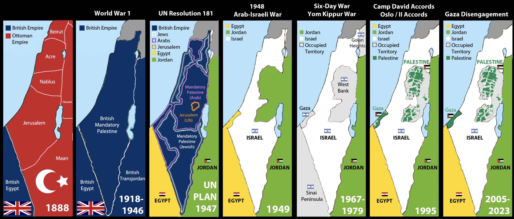

*Erosion of Palestine*

Throughout this entire period, the United States has provided unwavering financial and military support to Israel. [**Since 1948, the US has provided over $250 billion in cumulative military aid to Israel alone**](https://www.cfr.org/article/us-aid-israel-four-charts) (adjusted for inflation), excluding economic support, making it the largest cumulative recipient of US foreign assistance by far. This support has been instrumental in enabling Israel's military dominance and its ability to maintain the occupation and apartheid system with impunity.

  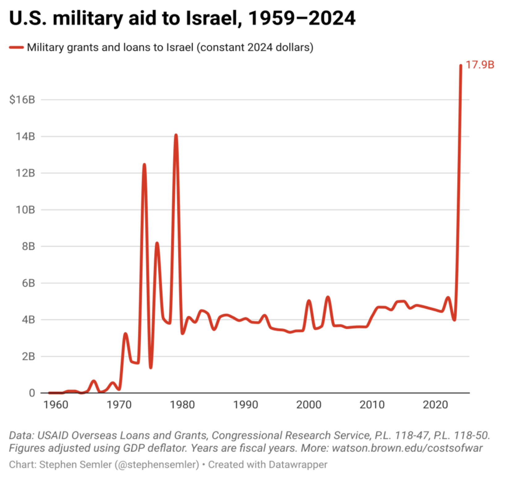
  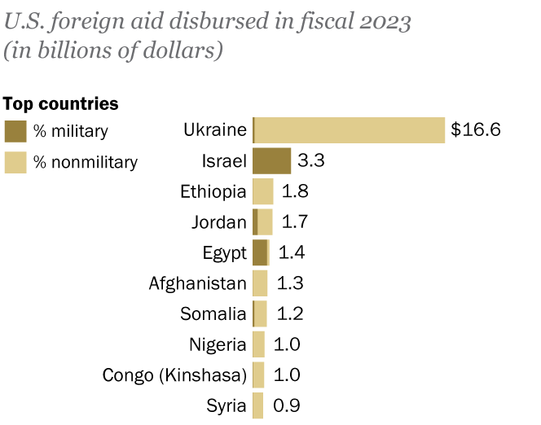

*(left) Historical trend of US military aid to Israel ([source](https://costsofwar.watson.brown.edu/sites/default/files/papers/Costs-of-War_US-Support-Since-Oct7-FINALv2.pdf)); (right) 2023 US aid by country ([source](https://www.pewresearch.org/short-reads/2025/02/06/what-the-data-says-about-us-foreign-aid/)).*

The UN OCHA curates a [dataset of casualties](https://www.ochaopt.org/data/casualties) in the occupied Palestinian territory (oPt) since 2008. It doesn't yet include the genocide in Gaza post Oct. 2023. **The ratio of Palestinian to Israeli casualties since 2008 is approximately 20:1**. In September 2023, they also published the updated [OCHA Gaza Strip Access and Movement map](https://www.ochaopt.org/content/gaza-strip-access-and-movement-september-2023), which I highly encourage you to read, as it clearly quantifies the persistent unlivable conditions in the Gaza Strip concentration camp. While reading it, I could not help but think:

> **If I grew up in Gaza and managed to survive to adulthood, what would I do?**

## Palestine today

### Gaza

Between October 8, 2023 until time of writing, there has been a military onslaught onto the Gaza Strip of unprecedented scale and brutality. Israeli Prime Minister Benjamin Netanyahu, with diplomatic, economic and military support from United States Presidents Biden and Trump, and the US sphere of influence (EU, Canada, Australia, UK, etc.), has perpetuated a genocide in Gaza. 

As of October 7, 2025, according to [reports](https://app.powerbi.com/view?r=eyJrIjoiODAxNTYzMDYtMjQ3YS00OTMzLTkxMWQtOTU1NWEwMzE5NTMwIiwidCI6ImY2MTBjMGI3LWJkMjQtNGIzOS04MTBiLTNkYzI4MGFmYjU5MCIsImMiOjh9) by the World Health Organization (via data provided by the Gaza Ministry of Health), 68,858 Gaza citizens have been killed and 170,664 have been injured. At least 10% of the approximately 2.2 million people living in Gaza before the war have been either injured or killed. Recent analysis by public health experts suggests that the number of fatalities reported by the Gaza Ministry of Health, which faces many obstacles to making a full account of the deaths, may be a significant undercount of the violent deaths. 

| Category | Value | Notes |
|----------|--------|-------|
| Palestinians Killed in Gaza | ~70,000 | Official count likely significantly undercounted.  ~25% of all Palestinian deaths are children. |
| Palestinians Injured in Gaza | ~170,000 |  |
| Gaza Infrastructure Destroyed | ~80%+ |  |
| Gaza Population Displaced | ~2 million | Nearly entire population displaced, multiple times. |
| Israelis Killed In Gaza | ~600  | ~ [500 soldiers](https://www.timesofisrael.com/authorities-name-44-soldiers-30-police-officers-killed-in-hamas-attack/) and ~70 civilians |

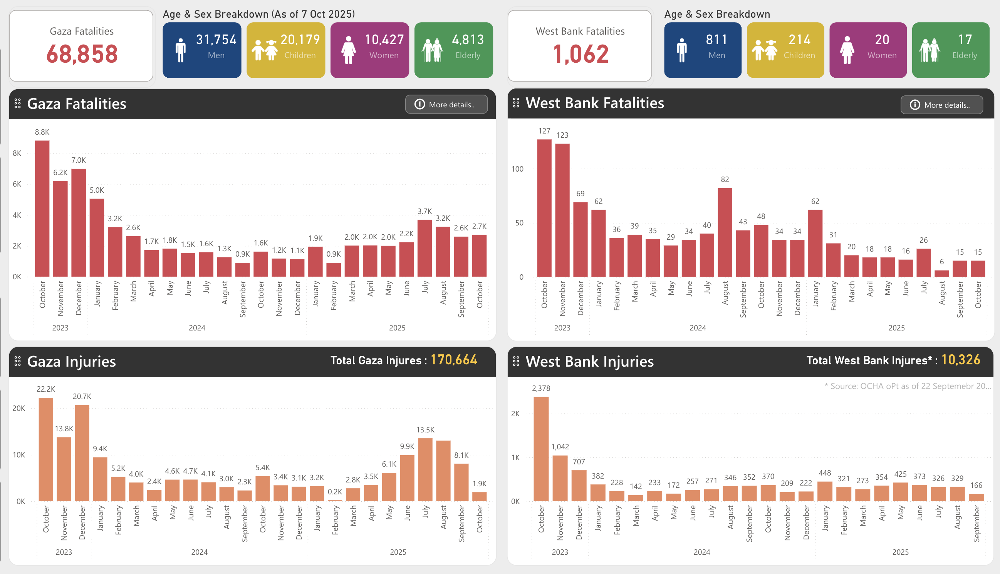

*Palestinian casualties from October 8, 2023 to October 7, 2025, illustrating the genocidal scale of Israel's assault on Gaza. [Source](https://app.powerbi.com/view?r=eyJrIjoiODAxNTYzMDYtMjQ3YS00OTMzLTkxMWQtOTU1NWEwMzE5NTMwIiwidCI6ImY2MTBjMGI3LWJkMjQtNGIzOS04MTBiLTNkYzI4MGFmYjU5MCIsImMiOjh9)*

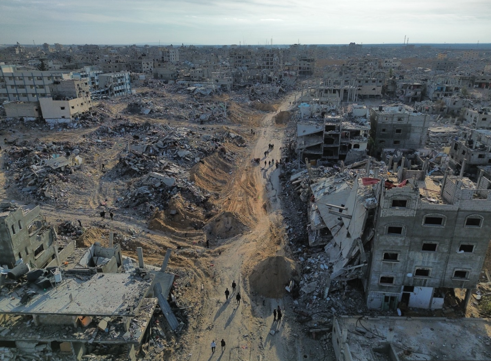

*View of destruction in Rafah, southern Gaza Strip, January 2025. [© 2025 UNRWA Photo by Ashraf Amra](https://www.unrwa.org/resources/reports/unrwa-situation-report-156-situation-gaza-strip-and-west-bank-including-east-jerusalem)*

[Satellite images](https://www.nbcnews.com/world/gaza/satellite-images-destruction-gaza-strip-rcna236089) from Planet Labs published by NBC News are appalling.

At this scale of destruction, a catastrophic public health crisis is inevitable. Beyond the immediate casualties, many more indirect ones will add to the count from severe injuries, famine and malnutrition, diseases, and the collapse of basic services, medicine, medical care, clean water, and electricity due to the systematic destruction of life carried out by the Israeli military. This detailed [report](https://costsofwar.watson.brown.edu/sites/default/files/2025-10/Human-Toll-in-Gaza_Costs-of-War_Crawford_7-October-2025.pdf) by the Watson School of International and Public Affairs Cost of War project captures the gravity of the situation in Gaza. 

In May 2024 the International Court of Justice (ICJ) extended earlier orders ([January](https://www.icj-cij.org/sites/default/files/case-related/192/192-20240126-ord-01-00-en.pdf) and [March](https://www.icj-cij.org/sites/default/files/case-related/192/192-20240328-ord-01-00-en.pdf)) in the genocide case brought by South Africa against Israel, and issued a [more detailed order](
https://www.icj-cij.org/sites/default/files/case-related/192/192-20240524-sum-01-00-enc.pdf) requiring Israel to:

> *"Immediately halt its military offensive, and any other action in the Rafah Governorate, which may inflict on the Palestinian group in Gaza conditions of life that could bring about its physical destruction in whole or in part."*

Israel has ignored these orders.

By late 2024, multiple human rights organizations have denounced war crimes and genocide being committed by Israel in Gaza:

- [Amnesty International](https://www.amnesty.org/en/latest/news/2024/12/amnesty-international-concludes-israel-is-committing-genocide-against-palestinians-in-gaza/) concluded that Israel is committing genocide against Palestinians in Gaza.
- [Human Rights Watch](https://www.hrw.org/news/2024/12/19/israels-crime-extermination-acts-genocide-gaza) documented Israel's crimes of extermination and acts of genocide in Gaza.
- [Israeli human rights groups](https://www.theguardian.com/world/2025/jul/28/israel-committing-genocide-in-gaza-say-israel-based-human-rights-groups), including B'Tselem and Physicians for Human Rights Israel, have stated that Israel is committing genocide in Gaza.

In November 2024, the International Criminal Court (ICC) [**issued arrest warrants**](https://www.icc-cpi.int/news/situation-state-palestine-icc-pre-trial-chamber-i-rejects-state-israels-challenges) for Benjamin Netanyahu (Israeli Prime Minister) and Yoav Gallant (Israeli Minister of Defense) alleging **responsibility for the war crimes of starvation as a method of warfare and intentionally directing an attack against the civilian population, and the crimes against humanity of murder, persecution, and other inhumane acts commited from October 8, 2023.**

On 16 September 2025, the United Nations Human Rights Council published a [legal analysis of Israel's conduct in Gaza](https://www.un.org/unispal/wp-content/uploads/2025/09/a-hrc-60-crp-3.pdf) concluding that:

> **"The State of Israel bears responsibility for the failure to prevent genocide, the commission of acts of genocide, and the direct and public incitement to genocide in Gaza."**

This report meticulously documents patterns of systematic destruction, deliberate starvation, and the direct targeting of civilians, children, and civilian infrastructure that collectively demonstrate genocidal intent. This analysis represents the culmination of months of investigation by the UN's independent experts.  
The systematic targeting of journalists and humanitarian workers has been particularly striking. Over 200 journalists and media workers have been killed in Gaza since October 2023, making it the deadliest conflict for journalists in recorded history. 1,400 humanitarian workers have also been killed, including UN staff, medics, and aid workers, often in clearly marked vehicles and facilities.

> **Note:** Given the protracted suppression of independent investigations and journalistic reporting, it is highly likely that the Israeli military has been systematically destroying additional evidence of war crimes and genocide.

[US military aid to Israel during 2023-2025](https://costsofwar.watson.brown.edu/paper/AidToIsrael) has been unprecedented, reaching a cumulative $21.7 billion, with an additional $10 billion allocated to US military operations in Yemen, Iran, and the wider Middle East region.

In September 2025, Trump and Netanyahu announced a unilateral ["peace plan"](https://www.bbc.com/news/articles/c70155nked7o) that was [heavily criticized](https://www.ohchr.org/en/press-releases/2025/10/palestine-any-peace-plan-must-respect-international-law-beginning-self) for its blatant disregard of Palestinian rights, sovereignty over the occupied territories, and international law. Since then, negotiations with what remains of Hamas in Gaza have been ongoing, with attempts at establishing a ceasefire. **This plan must be stopped.**

The UN Special Rapporteur on the situation of human rights in the Palestinian territories occupied since 1967, Francesca Albanese, released a [comprehensive report titled *Gaza Genocide: a collective crime*](https://www.ohchr.org/sites/default/files/documents/hrbodies/hrcouncil/coiopt/a-80-492-advance-unedited-version.pdf) in October 2025, which asserts that the ongoing genocide is sustained by the complicity of influential Third States through direct support, material aid, and diplomatic protection of Israel. It analyzes four categories of support, diplomatic, military, economic, and "humanitarian", demonstrating how these ties enable Israel to maintain its occupation and genocidal campaign. The report concludes that these powerful states have failed to uphold their international legal obligations, thereby contributing and underscoring a crisis in the international rule of law. The Rapporteur calls for urgent international action:

> *Recalling her previous recommendations, the Special Rapporteur reminds all States of their legal obligation not to participate in or be complicit with Israeli violations, and to instead prevent and address serious breaches of international law, particularly as set out in the UN Charter and Genocide Convention.*
>
> *Given the enduring emergency unaddressed by current "peace" discussions and plans, the Special Rapporteur urges States to cause no further harm to the Palestinian people and to:*
>
> > *(a) Exert pressure for a complete and permanent ceasefire and full withdrawal of Israeli troops;*
> >
> > *(b) Take immediate steps to end the siege in Gaza, including deploying naval and land convoys to ensure safe humanitarian access and mobile housing before winter;*
> >
> > *(c) Support the re-opening of Gaza's international airport and port to facilitate aid delivery.*
>
> *Beyond the emergency, States must recognize Palestinian self-determination and justice as essential to lasting peace and security, and therefore:*
>
> > *(a) Suspend all military, trade and diplomatic relations with Israel;*
> >
> > *(b) Investigate and prosecute all officials, corporates and individuals involved in or facilitating genocide, incitement, crimes against humanity and war crimes and other grave breaches of international humanitarian law;*
> >
> > *(c) Secure reparations, including full reconstruction and return;*
> >
> > *(d) Cooperate fully with the International Criminal Court and the International Court of Justice;*
> >
> > *(e) Reaffirm and strengthen support to UNRWA and the UN system as a whole;*
> >
> > *(f) Suspend Israel from the United Nations under Article 6 of the UN Charter;*
> >
> > *(g) Act under "Uniting for Peace", in line with General Assembly resolution 377(V), to ensure that Israel dismantles its occupation.*
>
> *The Special Rapporteur also urges trade unions, lawyers, civil society and ordinary citizens to monitor States' actions in response to these recommendations, and to continue to press institutions, governments and corporations for boycotts, divestments and sanctions, until the end of the Israeli illegal occupation and related crimes.*
>
> — Francesca Albanese, UN Special Rapporteur, *Gaza Genocide: a collective crime* (October 2025)

### West Bank

The UN Human Rights Office [report on oPt](https://www.un.org/unispal/document/ohchr-press-release-17oct25/), estimates that in the past 2 years, in the West Bank alone, ~1,000 Palestinians have been killed, mostly by Israeli military forces, of which about 200 are children. According to this report, almost half were unarmed, and not involved in any violence or confrontation at the time of their killing. One 174 Palestinians, including 71 children, were killed while throwing stones or Molotov cocktails, often at well-equipped and protected ISF vehicles. Israeli airstrikes on Palestinian towns and refugee camps made up a considerable portion of the casualities, applying combat doctrines it developed during its offensives in Gaza.

| Category | Value | Notes |
|----------|--------|-------|
| Palestinians Killed in West Bank | ~1,000 | ~20% children. |
| Palestinians Injured in West Bank | ~10,000 | Predominantly civilians. |     
| Palestinians Displaced in West Bank | ~40,000 | |

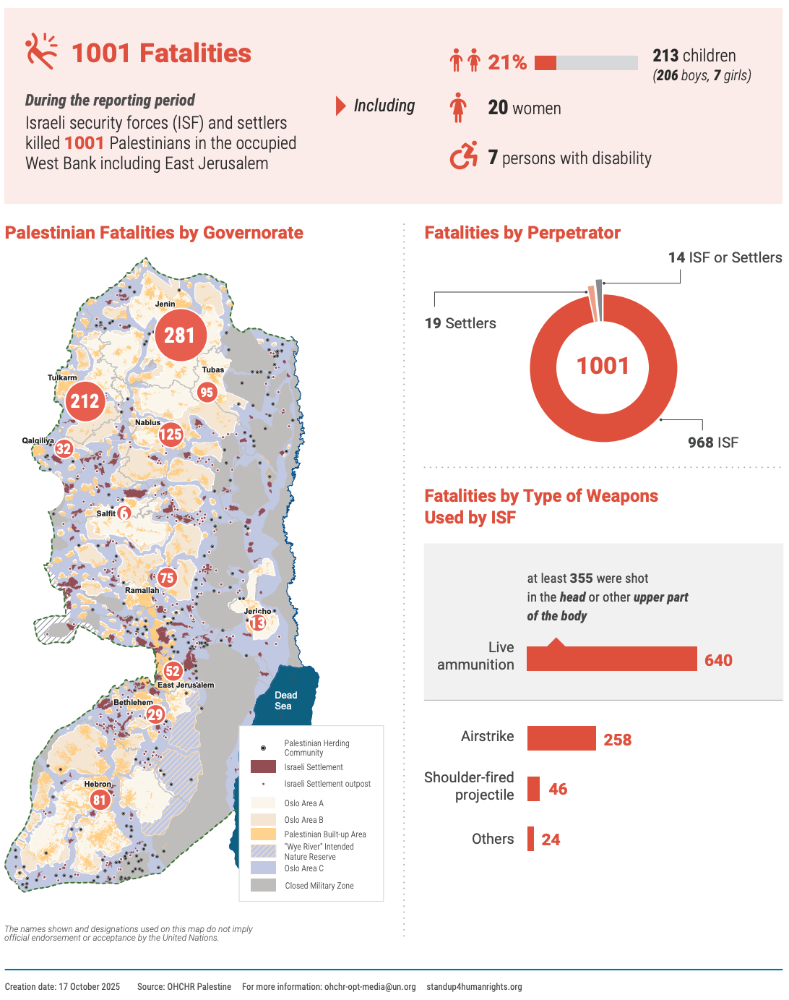

*Source: [UN Human Rights Office report on oPt](https://www.un.org/unispal/document/ohchr-press-release-17oct25/)*

Increasingly, settler attacks have played a major role in the violence in the West Bank. According to the [UN OCHA](https://www.ochaopt.org/content/west-bank-impact-setter-attacks-january-2023-june-2025), between January 2023 and June 2025, there were thousands of documented settler attacks resulting in 38 Palestinian deaths, 4,000 injuries, and 3,000 displaced people. These attacks often involve murder, physical assaults, property damage and destruction including arson, and intimidation tactics against Palestinian civilians, exacerbating tensions and contributing to the overall instability in the region.  
Israeli apartheid intensified throughout the West Bank and East Jerusalem. The [July 2025 map of West Bank access restrictions published by UN OCHA](https://www.ochaopt.org/content/west-bank-access-restrictions-map-july-2025) reveals the extensive network of checkpoints, roadblocks, and closed roads that fragment Palestinian territories. The systematic expansion of Israeli settlements, militarization of occupied land, and severe movement restrictions imposed on Palestinians are staggering.

The number of prisoners and detainees and hostages (the legality of the imprisonment is for many cases arbitray) in Israeli jails has surged to over 10,000, according to data from the Israel Prison Service (IPS). More than half have not been charged or tried and face indefinite detention. These figures exclude detainees from the Gaza Strip held by the Israeli military. Incarcerating citizens of the occupied Palestinian territory (oPt) inside Israel constitutes a blatant violation of the Fourth Geneva Convention, which prohibits the transfer of prisoners and detainees outside occupied territories. B'Tselem published a detailed and well documented report, titled [*Welcome to Hell* (2024)](https://www.btselem.org/sites/default/files/publications/202408_welcome_to_hell_eng.pdf) documenting the systematic torture, abuse, and denial of basic rights these detainees endure. I struggled to read it. 

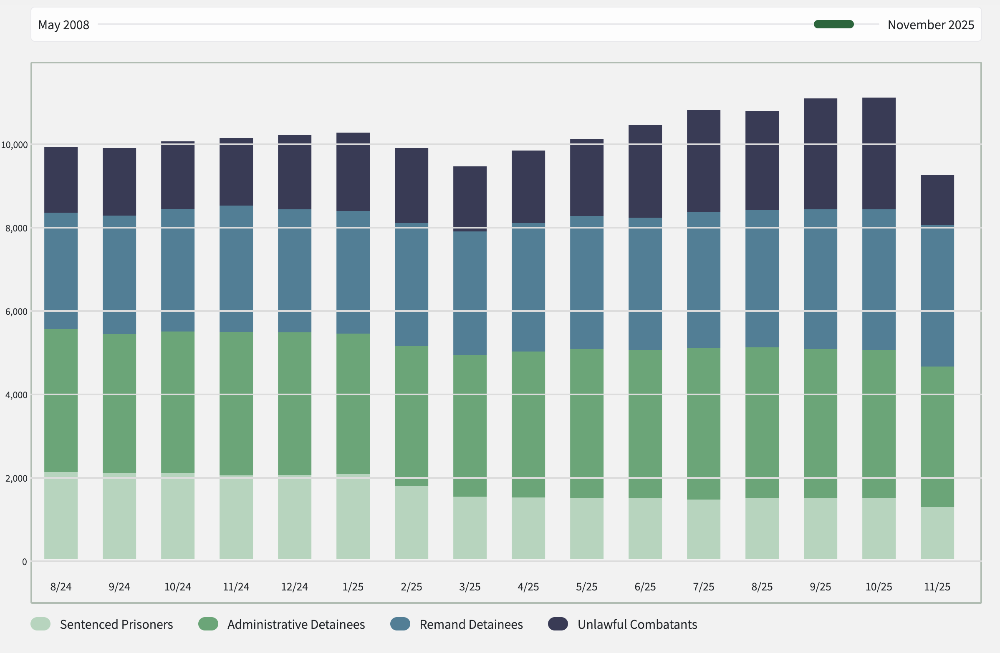

*Inmates held in Israeli prisons, the vast majority of whom are Palestinians. [Source: HaMoked](https://hamoked.org/prisoners-charts.php)*

## Manufactured Consent

Borrowing Edward Herman and Noam Chomsky's famous expression from their book [*Manufacturing Consent: The Political Economy of the Mass Media* (1988)](https://www.goodreads.com/book/show/12617.Manufacturing_Consent), I want to discuss how the Israeli state has made propaganda and political "donations" (in this context, a synonym for "bribes") the most powerful weapons in its military arsenal. This offensive has been waged primarily in the United States and other Western countries and succeeded at acquiring unwavering support for the past 70 years. 

The cardinal element is the American Israel Public Affairs Committee ([AIPAC](https://www.aipac.org/)). Since 1954, AIPAC has been shaping US foreign policy and directing American resources to fund the occupation of Palestine through direct and indirect financing of political campaigns and extensive lobbying of politicians. Notably and absurdly, it is not registered as a foreign agent, claiming that it does not take direction from a foreign government. For example, in the 2024 federal election cycle, AIPAC spent money to support about 80% of the races for congressional seats, spending roughly $100 million.

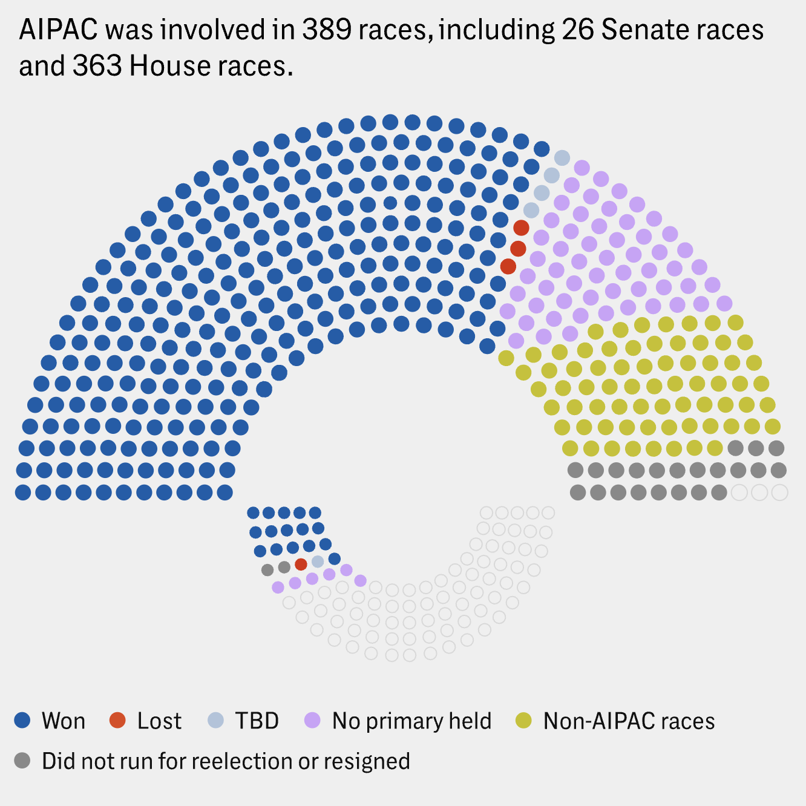

*AIPAC spending on congressional races in 2024. [Source: The Intercept](https://theintercept.com/2024/10/24/aipac-spending-congress-elections-israel/)*

And it doesn't stop at the houses of congress. AIPAC also exerts significant influence over the executive branch, the judiciary, state and local elections and, of course, the media. No wonder every single US president since Truman has been a staunch supporter of Israel, regardless of party affiliation. A book could be written on AIPAC alone, but I want to focus on the broader propaganda apparatus. 

In 1984, two years after the invasion of Lebanon, the [American Jewish Congress](https://ajcongress.org/) sponsored a conference in Jerusalem titled [*Hasbara*](https://www.bjpa.org/content/upload/bjpa/the_/THE%2019TH%20AMERICAN-ISRAEL%20DIALOGUE-HASBARA%20ISRAEL'S%20PUBLIC%20IMAGE%20PROBLEMS%20AND%20REMEDIES%201984%20VOL%2051%20NO%202-3.pdf) (Hebrew for "explanation"). Participants included PR and advertising executives, media professionals, journalists, and leaders of major Jewish organizations. The conference's stated objective was to develop methodologies for presenting unpalatable policies, countering adversarial press coverage, and pre-emptively shaping media narratives. As one participant candidly put it:

> *"Face it: We are in the game of changing people's minds, of making them think differently. To accomplish that we need propaganda."*

The conference was chaired by advertising executive Carl Spielvogel, a re-branding specialist, who had been hired by the Israeli government to improve its international image following the 1982 Lebanon War. In his opening remarks, Spielvogel stated:

> *"I would urge the creation of a Cabinet post dedicated exclusively to the communication and interpretation of Israeli policy. Again, the minister who holds this job would not be setting policy, but presenting it in the most attractive way to the rest of the world. If a Ministry of Communications were to be established, the appropriate minister would have to be supported by a staff of Israeli professionals, trained in the contemporary skills of communication."*

The core narratives yielded by Hasbara methodologies are actually quite simple and needless to say, lies:

- **All Palestinian resistance is terrorism while Israeli aggression is self-defense.**
- **Israeli settlements are legitimate and not an obstacle to peace.**

Another particularly revealing document is the [*Global Language Dictionary*](https://www.transcend.org/tms/wp-content/uploads/2014/07/sf-israel-projects-2009-global-language-dictionary.pdf) (2009) by Frank Luntz for The Israel Project, a comprehensive training resource for Israeli propaganda specifically targeting the American public. The document's core principle is clear: **dominate the narrative with defense from terror, not disputes over territory**. It goes without saying that lying is a core skill taught throughout this manual. Some of the most revealing excerpts include:

> *"Remember: communication is not a test for who can remember the most facts. Listeners want simple messages that will answer their simple, silent question: 'What is in it for my country and for me to support Israel?'"*
>
> *"You need to start with empathy for both sides, remind your audience that Israel wants peace and then repeat the messages of democracy, freedom, and peace over and over again."*

On territorial concessions, the manual explicitly instructs propagandists to reframe the issue:

> *"A strong majority of Americans (58%) agree with the simple statement that Israel should give the land it captured in 1967."*
>
> *"Avoid talking about borders in terms of pre- or post-1967, because it only serves to remind Americans of Israel’s military history."*
>
> *"Israel should not give any more land for peace, because every time it does, it just gets more war."*

The document insists on ideological framing over territorial reality:

> *"The fight is over IDEOLOGY – not land; terror, not territory."*

When addressing Israeli settlements, which the majority of public opinion opposes, the manual advocates for a complete reversal of the narrative, framing the issue as one of peaceful coexistence between two peoples living side by side:

> *"The settlements are the single toughest issue for Israel and the hostility towards them and towards Israeli policy that appears to encourage settlement activity is clearly evident."*
>
> *"Americans are far more favorable towards solutions that are “just a redrawing of borders on the map” and do not require anyone, Israeli or Palestinian alike, to leave their own homes."*
>
> *"Israel does not talk about dismantling Arab settlements within Israel. In a democratic society, Jews and Arabs should be able to live side-by-side in peace. Nobody ever says Israeli territory has to be free from Arabs. One should ask the Palestinian leadership why they always demand land that is free from Jews."*

Perhaps most cynically, when addressing the Palestinian right of return, the manual dedicates a chapter to **"THE RIGHT OF RETURN = RIGHT OF CONFISCATION"**, in which instructs advocates to invoke the Holocaust and draw false equivalences:

> *"Could you explain for those who may not understand the right of return means for the Palestinians?"*
>
> *"Unfortunately some sixty years ago, we were witness to the atrocities perpetrated against six million because they had no place to go... That is very different than the Palestinians saying 'we want to have a state for our people, but we also want land in yours.' We accept the former. We cannot accept the latter."*
>
> *"Most of all, Americans want a better future. They don't want to dwell on the past problems with Palestinian refugees anymore than they think America should give New York back to the American Indians. Talk about how sometimes you can't turn back the clock – you need to move forward."*

[*The Occupation of the American Mind*](https://www.youtube.com/watch?v=dP0-YohJR-g) is a 2018 documentary featuring numerous experts discussing Israeli propaganda. Predictably, the film faced significant distribution challenges.

 

The indoctrination of Israeli Jews from infancy is thorough and has created a deeply jingoistic and openly racist society. The documentary [*Israelism: The Awakening of Young American Jews*](https://www.israelismfilm.com/) provides a clear picture of the pervasive doctrines, dogmas, and myths instilled in young Jewish Israeli and Americans. Through the [Birthright program](https://www.birthrightisrael.com/), young American Jews can participate in a fully funded ten-day journey to Israel, designed to cement their attachment to the state and promote permanent immigration via the [Law of Return](https://en.wikipedia.org/wiki/Law_of_Return).  
As an example of how detached from reality and moral foundation much of Israeli Jewish society is, a May 2024 [survey reported by Haaretz](https://www.haaretz.com/israel-news/2024-05-28/ty-article-magazine/.premium/yes-to-transfer-82-of-jewish-israelis-back-expelling-gazans/00000197-12a4-df22-a9d7-9ef6af930000) found that **82% of Jewish Israelis support the expulsion of Palestinians from the occupied territories.** That's ethnic cleansing by popular demand. No wonder social media has been flooded with racist content posted by Israeli citizens celebrating the aborrent genocidal acts that IDF soldiers voluntarily recorded and shared, which I am not going to link here. The assumed level of impunity is staggering.

Many western media outlets have played a significant role in perpetuating Israel's propaganda, employing the same tactics that for decades have manufactured consent for US imperialist wars. The most relevant ways this is done are:

- Coverage: favoring Israeli perspectives and narratives, including selective reporting. 
- Source reliance: heavy dependence on Israeli government, military, and allied sources, while marginalizing Palestinian institutions and independent journalists.
- Language: *"Israeli hostages"* vs *"Palestinian prisoners"*, emotionally charged language used primarily to describe Israel's casualties (*"massacre"*, *"slaughter"*, *"horrific"*) while passive language is used for Palestinians (*"loss of life"*, *"killed"*), disregard for proportions, refrain from using the words *"genocide"*, *"war crime"*.
- Omission of context: Refer to the *"Israel-Hamas war"* without historical context of occupation, apartheid, disproportionate aggression. 
- Misinformation: unverfied claims such as *"behaded babies"*, *"systematic rape"* which were debunked but widely circulated to demonize and dehumanize Palestinians.

Read more about this [here](https://www.theguardian.com/commentisfree/2023/oct/16/the-language-being-used-to-describe-palestinians-is-genocidal), [here](https://arxiv.org/html/2510.06453v1), [here](https://institute.aljazeera.net/en/ajr/article/3081) and [here](https://theintercept.com/2024/01/09/newspapers-israel-palestine-bias-new-york-times/). 

 

Finally I wanted to mention the repression of student (and faculty) protests on University campuses. In the US, pro-Palestinian activism has been met with hostility and suppression, often under the guise of combating antisemitism. Universities have faced pressure from the Biden and Trump administrations, the latter threatening to [withhold federal funding](https://www.ed.gov/about/news/press-release/doj-hhs-ed-and-gsa-announce-initial-cancelation-of-grants-and-contracts-columbia-university-worth-400-million) from institutions perceived as harboring anti-Israel sentiment.  
Columbia University Professor [Rashid Khalidi](https://en.wikipedia.org/wiki/Rashid_Khalidi) denounced Columbia University's actions and its deal with the Trump administration by cancelling his 2025 Fall course on modern middle-east history. Specifically, in his [open letter](https://www.theguardian.com/commentisfree/2025/aug/01/columbia-historian-rashid-khalidi-open-letter) he wrote:
> *"It is impossible to teach this course (and much else) in light of Columbia’s adoption of the International Holocaust Remembrance Alliance (IHRA) definition of antisemitism."*
>
> *"Under this definition of antisemitism, which absurdly conflates criticism of a nation-state, Israel, and a political ideology, Zionism, with the ancient evil of Jew-hatred, it is impossible with any honesty to teach about topics such as the history of the creation of Israel, and the ongoing Palestinian Nakba, culminating in the genocide being perpetrated by Israel in Gaza with the connivance and support of the US and much of western Europe."*

## Reflections

### Does Israel Have the Right to Exist?

This is perhaps the most commonly deployed question used to constrain public debate within the Zionist framework. Here is why it's fundamentally manipulative.

States are power structures created by people to organize themselves. They are not moral agents. They are not living beings. People are. Does a specific political party have the right to exist? Does a particular corporation have the right to exist? No, they simply exist as constructs. People have the right to organize themselves and duties when doing so. What they create doesn't a priori have the right to exist. It all depends on what they create and how they do so. 

The question conflates the existence of a state structure with the existence of people. Do the people who have organized themselves under the state of Israel have the right to exist? Of course. All people have the right to exist. But that right does not extend to anything they do while existing, nor does it legitimize the means by which their state was established.

In the case of Israel, the state was established through the occupation of Palestine and the displacement and killing of nearly a million native Palestinians (the 1948-49 Nakba), in systematic violation of human rights. Did the world gain rights through this process? No, it suffered an enourmous net loss. 

The question *"Does Israel have the right to exist?"* is designed to prevent us from asking the more relevant questions: *"Did Israel have the right to be created through ethnic cleansing and occupation?"* and *"Given that the state of Israel was created, what sovereignty do you recognize? Are the occupied territories part of it?"*.

### What Peace

The imposition of will through incremental use of violence has been from the beginning the modus operandi of the State of Israel. This has created Hezobollah and Hamas, which mirrored incremental use of violence to resist. The choice of expansion over security has been a genocidal policy for the Palestinians and suicidal for Israel, which has long been a morally bankrupt pariah state.

If reason prevails, the bare minimum that can be done towards peace is to give back to the Palestinians what is still there of what was robbed: their rights, their land, their resources and their independence. The internationally recognized borders pre-1967 (80% Israel / 20% Palestine) are the practical basis for an agreement, although largely unjust. In a different time and cultural framework, one democratic and unified state for all its citizen could arise. Unfortunately if this one state was implemented today, would just be the Greater Israel apartheid state.  

I doubt that change within Israeli society alone is possible. Instead, change is more likely to come from its major backer, the United States. The proliferation of videos, photos documenting the reality in Gaza and the occupied Palestinian territories has contributed significantly to growing awareness, cutting through mainstream media propaganda that has struggled to ignore this evidence. If solidarity with Palestine and opposition to imperial occupation of the Middle East continues to gain momentum in the US, a critical threshold could be reached that forces Israel to accept a two-state solution based on international law and the pre-1967 borders. Pressure must increase. Joining the initiatives of movements such as the [Boycott, Divestment, Sanctions (BDS)](https://bdsmovement.net/) is a good way to do so. 
